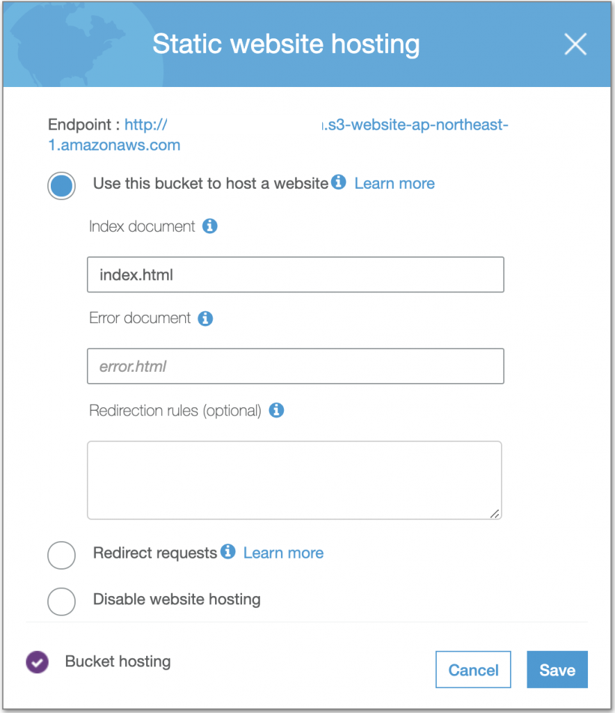
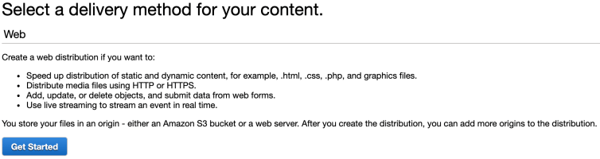
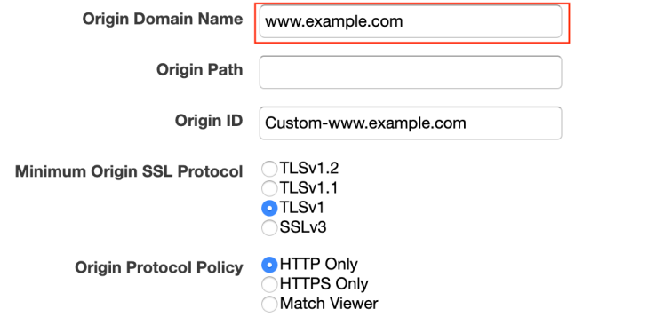
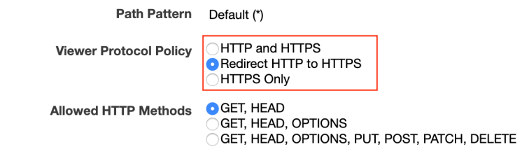
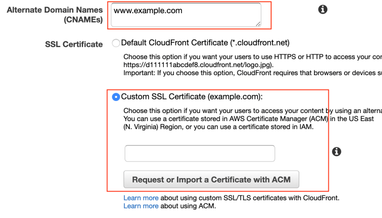
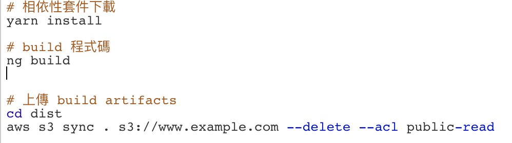
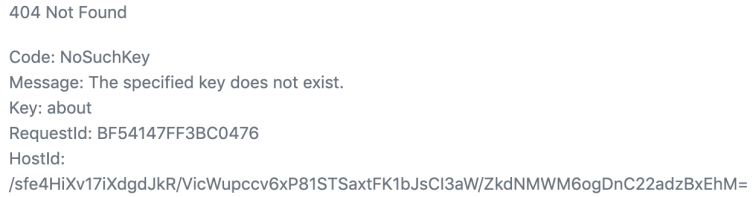

## 前言

大部份 AWS 的使用者都如道 S3 提供一個僅需在管理頁面點擊設定便可以讓 Bucket 變成靜態網頁的方法。
但也僅提供 HTTP 連線方式，如果我要的是個`客制化的 Domain + HTTPS 協定`呢?

這時候我們所只需要 [Cloudfront][aws-cloudfront] 及 [Certificate Manager][aws-cm] 這兩個服務來達成我們目的。如果有網域名稱的需求也可以利用 [Route53][aws-route53] 來做購買的動作。

## 建立 AWS S3 Bucket 

假設我已經擁有一個叫`www.example.com`的網域名稱，接下來的步驟:

- 建立一個與域名相同的 Bucket Name，這裡的範例就會是`www.example.com`。
- 開啟 Bucket 中 `Static website hosting` 的功能並且**複制 Endpoint 裡的網址**。
  

## 設定 AWS Cloudfront

- ### 選擇 **`Web`** delivery method。

  

- ### 將 [Bucket 的 Endpoint](#chapter-1) 填入 `Origin Domain Name`。

  

- ### 設定協定方式

  我希望只提供 **HTTPS** 的連線方式，所以我會選擇自動導向的方式，避免使用者輸入 http 開頭的網址後出現錯誤

  

- ### 設定域名及憑證

  此範例的域名就是`www.example.com`，而憑證的申請並不會太困難，可參考官方文件或是 google 申請的教學。

  最後只要點擊建立並且等待至少 15 分鐘的時間生效。

  

## Jenkins 自動 Deploy(optional)

為了可以減少開發中多餘的動作，自動部署的功能就重要多了，這也是 CI/CD 現在被重視的原因了。

而這裡我使用的是 Jenkins，動作主要有兩步驟，也就是`編譯與部署`

## 實作中遇到的問題

在實作完成後，我也很幸運的遇到問題了，在存取的時候出現下圖的錯誤

在請教 Google 大神後也找到了[解法](https://github.com/kriasoft/react-firebase-starter/issues/141)，
這裡面提供了兩種解法

- [為這個錯誤做重新導向](https://github.com/kriasoft/react-firebase-starter/issues/141#issuecomment-244115218)
- [在 S3 的 Web hosting 裡設定錯誤頁面](https://github.com/kriasoft/react-firebase-starter/issues/141#issuecomment-285772833)

我選擇的是直接做導向這個解決方式並且很順利的解決了這個問題，現在也可以正常存取了。

## 總結

AWS 的多元化的服務讓使用者僅需利用介面的操作便能達目的，個人認為是很直覺又方便的一件事，
這種一條龍的方式也減少了使用者切換平台而造成多餘的時間成本，很值得學習。

[aws-route53]: https://aws.amazon.com/route53/?nc2=type_a
[aws-cm]: https://aws.amazon.com/certificate-manager/?nc2=type_a
[aws-cloudfront]: https://aws.amazon.com/cloudfront/?sc_channel=PS&sc_campaign=acquisition_TW&sc_publisher=google&sc_medium=cloudfront_b&sc_content=cloudfront_e&sc_detail=aws%20cloud%20front&sc_category=cloudfront&sc_segment=165240657802&sc_matchtype=e&sc_country=TW&s_kwcid=AL!4422!3!165240657802!e!!g!!aws%20cloud%20front&ef_id=Cj0KCQjw9ZzzBRCKARIsANwXaeKmwmjacNS9IzzJ_mkQYoFHLr9_0uWUt8kGWI3xEu9zQlDm36GLOXAaAuz6EALw_wcB:G:s
