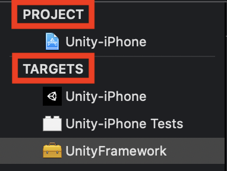

## 前言

目前因為需求的關係，需要將專案分成五個不同的執行環境。而且，因為專案有導入`Firebase`的關係，
我們利用 `Flavor` 來區分各別環境。專案中又有使用到 Unity 模組。在`Android`的環境上執行都很順利
，但是，在執行 iOS 的時候卻會出現錯誤。來紀錄一下我的問題發生經過及解決方式吧。

## Project Level Configs vs Trage Level Congis

在此之前，我們先來了解一下 iOS 中 `Project Level Target` 與 `Native Level Targes` 之間的關係及差別吧。

在這就先道破吧 -  `Target Level` 比 `Project Level` 的層級高。所以，有衝突的設定會以 Target Level 為先。



簡單說，Project 就是像是 `Common 設定`，而 Target 會再根據需求加入或是修改設定。
在 `Target Level` 中，與 `Project Level` 同名的稱 `Main Target`

## 如何手動解決外部模組 Build Flavor 錯誤

[Flavor 的設定](https://medium.com/@salvatoregiordanoo/flavoring-flutter-392aaa875f36)由於 Google 上的教學很詳細了，
在此就不多做敘述。

在下`flutter build ios --no-codesign -t lib/main_prod.dart --flavor production`時，馬上就會出現編譯錯誤。
原因就是來自外部匯入的模組 - `Unity-iPhone`上。在花了不少時間找答案卻沒什麼結果的時候，我忽然靈光一閃，
想說為什麼我不試試看也在這外部模組中多加入跟我主要專案上一樣的設定檔就好。結果，還真的被我編譯成功且能正常執行。
雖然高興了一下，但接著遇到的問題是，這個外部模組是個異動性極高，也就是說，即使我這次已經改成功了，
但下次也會因為重新匯出而造成我目前的設定檔被重置。我不可能每次重新匯入後就去改一次那個設定檔，
太不 Make Sence 了!!!

好吧，即然無法在專案內動手腳，那我就在匯出的時候動手腳了!

## 修改 Unity 匯出腳本

我相信，這種問題我絕對不是第一個。果然，
Unity 官方已經有提供現有的[API](https://docs.unity3d.com/ScriptReference/iOS.Xcode.PBXProject.html)，
幫我們解決這方面的需求了，讓我們可以完整存取 `Project Level` 及 `Target Level`的設定。
但因為小弟不熟悉的關係，所以，花了兩天 Try and Error 才把這問題解決。而整個過程中我只有使用到少數幾支 API

取得 Project GUID 的 [API](https://docs.unity3d.com/ScriptReference/iOS.Xcode.PBXProject.ProjectGuid.html)

```c#
public string ProjectGuid();
```

取得 Unity Framework 的 [API](https://docs.unity3d.com/ScriptReference/iOS.Xcode.PBXProject.GetUnityFrameworkTargetGuid.html)

```c#
PBXProject.GetUnityFrameworkTargetGuid();
```

取得 Unity Test 的 API。這裡我是利用另一種方式取得的，不是官方文件所提到的`GetUnityTestTargetName`

```c#
PBXProject.TargetGuidByName("Unity-iPhone Tests");
```

取得 Build Configs 的 [API](https://docs.unity3d.com/ScriptReference/iOS.Xcode.PBXProject.BuildConfigByName.html)

```c#
public string BuildConfigByName(string targetGuid, string name);
```

`targetGuid`就是上述中的`ProjectGuid`、`GetUnityFrameworkTargetGuid`及`TargetGuidByName("Unity-iPhone Tests")`所得到的24碼GUID，
`name`就是 Build Type 與各別 Flavor 形成的的設定檔名稱，如: `Debug-development`或是`Release Production`。

加入 Build Property 的 [API](https://docs.unity3d.com/ScriptReference/iOS.Xcode.PBXProject.AddBuildPropertyForConfig.html)

它有兩種建構型態

```c#
public void AddBuildPropertyForConfig(string configGuid, string name, string value);
public void AddBuildPropertyForConfig(IEnumerable<string> configGuids, string name, string value);
```

接下來，就是把設定加入到對應的設定檔即可。

## 後記

這問題讓我花較多時間的部份就只有在設定的收集及編排成可用格式上，這個部份比較瑣碎且費工。
另外，也因為之前不了解 Xcode 中 `.xbproject` 的架構，所以，花了點時間在 Try and Error 上。

## 參考資料

https://medium.com/@animeshjain/build-flavors-in-flutter-android-and-ios-with-different-firebase-projects-per-flavor-27c5c5dac10b
https://docs.unity3d.com/ScriptReference/iOS.Xcode.PBXProject.html
https://docs.unity3d.com/ScriptReference/iOS.Xcode.PBXProject.AddBuildConfig.html

https://unity3d.com/get-unity/download?_ga=2.81909398.1631348832.1588208861-1076366319.1588208861
https://unity3d.com/get-unity/download/archive