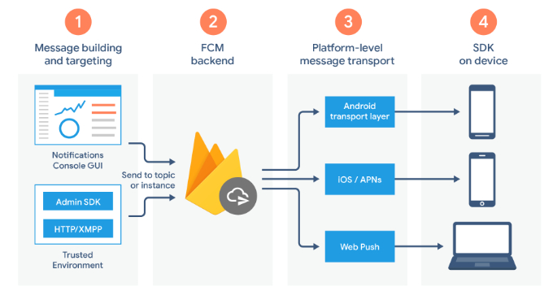
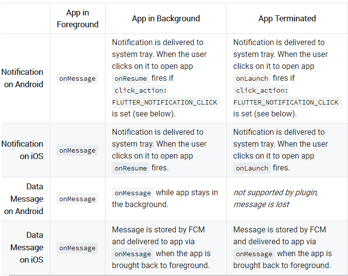
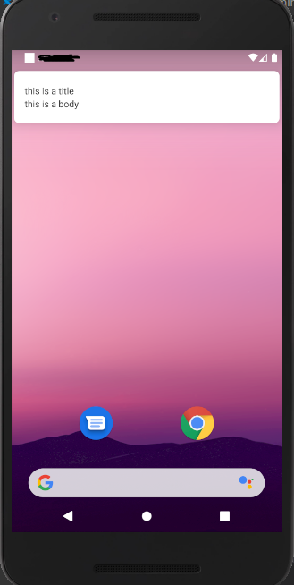
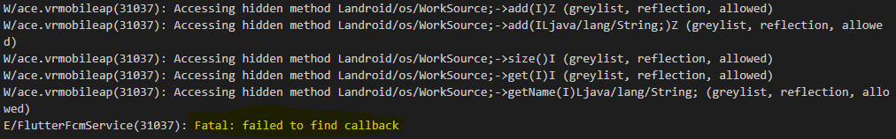
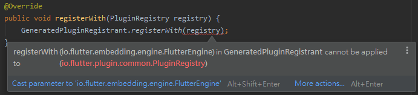
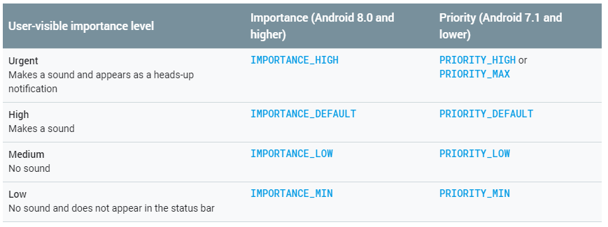
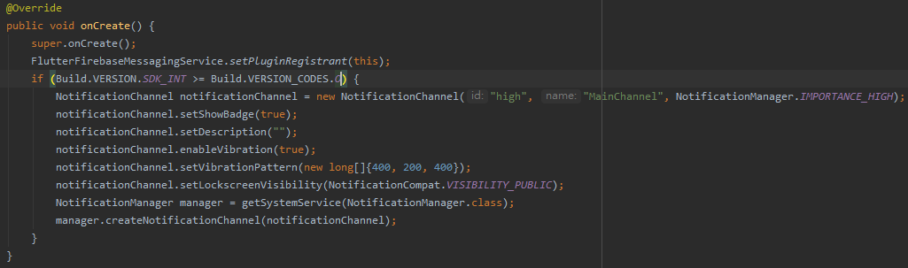
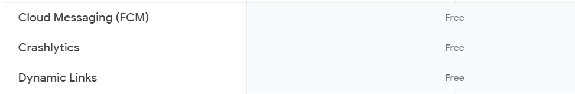

## 前言

最近 Flutter 的專案上剛好需要導入 [Firebase][link_firebase_site] 的
[Cloud Messaging][link_firebase_fcm_official_doc] 功能，
也紀錄一下實作的步驟以及遇到問題。

## Firebase Cloud Messaging

Firebase Cloud Messaging(FCM), 是 [Firebase][link_firebase_site] 提供的服務之一，
讓使用者進行`訊息(message)`發送與接收。主要負責:

- 傳送推播(`Notification`)與資料(`data`)訊息
- 提供三種發送方式
  - 單一裝置(`Single`)
  - 群組發送(`Groups`)
  - 訂閱群發送(`Subscribed`)
- 從客戶端(`Client`)發送訊息(`雙向`)

其基礎結構為



### Message Type

FCM 目前提供兩種訊息的傳輸模式`Notification`及`Data`。`Notification`是 SDK 在處理的，
而`Data`是 Client 處理。簡單說，在接收到`Notification`時，SDK 會將收到的訊息顯示在
手機上的訊息列並根據 [Notification Channel ID][link_notification_channel_id_doc]
決定是否顯示訊息提示窗，而`Data`可以讓 Client 經過處理後再決定是否要顯示或是執行其他的功能。
就我看來這兩者基本上的差別就是`Notification`預設有訊息提示窗而`Data`沒有。

FCM Notification Composer 沒有提供傳送`Data`的方法，需要使用 Call API 的方式。

主要的步驟只有兩個 - [Firebase 的基本設定][link_firebase_basic_setup]及
安裝官方提供的 flutter 的 cloud messaging 函式庫 - [firebase_messaging][link_flutter_firebase_messaging]

基本設定的部份，官方文件已經詳解了，在此就不加以說明了。

## 設定 Flutter FCM Library - [firebase_messaging][link_flutter_firebase_messaging] {#fcm_impl}

flutter pub 上的文件也已經詳解如何整合至 Android 或 iOS 了，基本上照做都能順利整合。
需要注意的是，如果希望 Client 在點擊訊息時能觸發`onResume`、`oLaunch`的 Handler ，
就必需在`android/app/src/main/AndroidManifest.xml`裡加上 filter

```xml
<intent-filter>
    <action android:name="FLUTTER_NOTIFICATION_CLICK" />
    <category android:name="android.intent.category.DEFAULT" />
</intent-filter>
```

先來看一下各個 Handler 在`Notification`及`Data` 的 Spec



讓我們使用 [Postman](https://www.postman.com/) 來測試`Notification`與`Data`這兩種傳送方式。

Payload 如下

Notification:

```json
{
  "notification": {
    "body": "this is a body",
    "title": "this is a title"
  },
  "priority": "high",
  "data": {
    "click_action": "FLUTTER_NOTIFICATION_CLICK",
    "id": "high",
    "status": "done"
  },
  "to": "YOUR CLIENT TOKEN"
}
```

Data:

```json
{
  "priority": "high",
  "data": {
    "click_action": "FLUTTER_NOTIFICATION_CLICK",
    "id": "high",
    "status": "done"
  },
  "to": "YOUR CLIENT TOKEN"
}
```

觀察 `Foreground`, `Background` 及 `Terminated` 的行為

- Foreground:

  - Notification

    觸發 Handler - onMessage

    ```text
    I/flutter (28543): on Message: {notification: {title: this is a title, body: this is a body}, data: {status: done, id: high, click_action: FLUTTER_NOTIFICATION_CLICK}}
    ```

  - Data

    觸發 Handler - onMessage

    ```text
    I/flutter (28543): on Message: {notification: {title: null, body: null}, data: {status: done, id: high, click_action: FLUTTER_NOTIFICATION_CLICK}}
    ```

    與文件相符。

- Background:

  - Notification

    出現訊息提示窗

    

    在點擊後回復 APP 至前景並觸發 Handler - onResume

    ```text
    I/flutter (28543): on Resume: {notification: {}, data: {collapse_key: "秘密", google.original_priority: high, google.sent_time: 1586406396631, google.delivered_priority: high, google.ttl: 2419200, from: 217808926832, id: high, click_action: FLUTTER_NOTIFICATION_CLICK, google.message_id: 0:1586406396651621%4e2e62744e2e6274, status: done}}
    ```

  - Data

    發生錯誤了!找不到相對應的 Callback function

    

    參考[pub 文件][link_flutter_fcm_doc] 並實作`onBackgroundMessage`這個 Handler 後就可以接到資料

    ```text
    I/flutter (31277): on Background data: {status: done, id: high, click_action: FLUTTER_NOTIFICATION_CLICK}
    ```

  `Data`的反應跟文件上有落差…，文件上表示應該觸發`onMessage`。

- Terminated:

  因為 Terminated 的狀態會看不到 Debug 的訊息，所以我用 Toast Message 來觀察行為，
  `Data`的部份文件已經表明會遺失，`Notification`試了之後也發現會出現提示窗，
  但自帶的 Data 也是遺失。

## Troubleshooting

### "PluginRegistry cannot be converted to FlutterEngine" 錯誤

在實作`onBackgroundMessage`的時候，`Application.java`如果是參考 pub 裡的實作會發生錯誤



參考[此文][link_error_on_registerwith]並實作新的 Class 取代舊的即可解決此問題

### 接收的到訊息但沒有顯示提示視窗

這問題在下列兩種使用方式都有出現

- 從 Firebase Cloud Message 的 Composer
- 利用 Call API 的方式觸發(如: cURL, postman...)

發生原因主要是因為沒有設定 Default Channel ID，其定義如下


解法:

1. 在`AndroidManifest.xml`加入下面的 meta

   ```text
   <meta-data
    android:name="com.google.firebase.messaging.default_notification_channel_id"
    android:value="high" />
   ```

   _`***測試後發現，如果希望在 Call API 的方式下能正常顯示提示窗，這個 meta 必需存在***`_

2. 在`Application.java`裡面實作`Notification Channel`

   

## 結論

FCM 提供了我目前所有的需求了，重點是它是**免費的**。



## 補充

### 20200410

在前面利用 Postman [測試的章節](#fcm_impl) 中，我們只對單一裝置進行測試，
但如果我們希望所有的裝置都能收到呢?
這裡就會必需 Client 端先做`訂閱(Subscribe)`的動作。
在 Flutter 裡僅需加一行程式碼即可，詳見[此文][link_fcm_send_all]

```flutter
firebaseMessaging.subscribeToTopic("all");
```

在 Request 的時候`to`的值取代成

```json
{
  "notification": {
    "body": "this is a body",
    "title": "this is a title"
  },
  "priority": "high",
  "data": {
    "click_action": "FLUTTER_NOTIFICATION_CLICK",
    "id": "high",
    "status": "done"
  },
  "to": "/topics/all"
}
```

<!-- external links -->

[link_firebase_site]: https://firebase.google.com/
[link_firebase_fcm_official_doc]: https://firebase.google.com/docs/cloud-messaging
[link_firebase_basic_setup]: https://firebase.google.com/docs/flutter/setup?platform=android
[link_flutter_firebase_messaging]: https://pub.dev/packages/firebase_messaging#-readme-tab-
[link_notification_channel_id_doc]: https://developer.android.com/training/notify-user/channels
[link_flutter_fcm_doc]: https://pub.dev/documentation/firebase_messaging/latest/
[link_error_on_registerwith]: https://stackoverflow.com/questions/59446933/pluginregistry-cannot-be-converted-to-flutterengine
[link_notification_channel]: https://developer.android.com/training/notify-user/channels
[link_fcm_send_all]: https://stackoverflow.com/questions/38237559/how-do-you-send-a-firebase-notification-to-all-devices-via-curl

<!-- some decent posts -->

[link_1]: https://www.djamware.com/post/5e4b26e26cdeb308204b427f/flutter-tutorial-firebase-cloud-messaging-fcm-push-notification
[link_2]: https://fireship.io/lessons/flutter-push-notifications-fcm-guide/
[30_days]: https://ithelp.ithome.com.tw/articles/10224272
