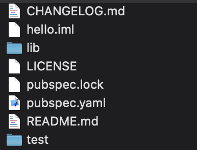
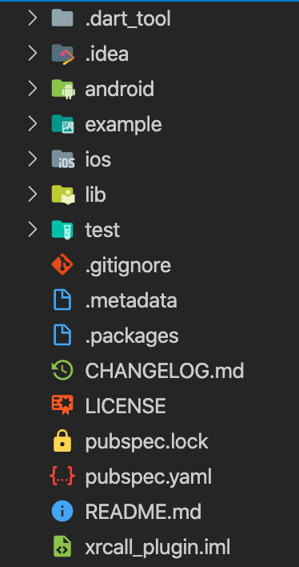

## 前言

最近公司為了趕出貨而忙的天慌地老的，連想寫個文章的精力都被榨乾了。所以，這也是慌廢了一個多月的第一篇文章。
最近，因為需求的關係，需要寫 Plugin 去 Call Native 的 API 來實現一些功能。讓我來紀錄一下我學到了什麼吧!

## Flutter Package

[Flutter Package](https://flutter.dev/docs/development/packages-and-plugins/developing-packages#plugin)
可以將常用或是想獨立的的程式碼模組化，以供之後的重復利用。只有分兩種型別`Dart Package`及`Plugin Package`。

- `Dart Package` - 以 [Dart](https://dart.dev/)撰寫，對 `Flutter Framework` 有相依性的組件。如: [path](https://pub.dev/packages/path)
- `Plugin Package` - 利用 `Dart` 提供的官方 API([Platform Channel](https://flutter.dev/docs/development/platform-integration/platform-channels))與原生平台(**iOS/ Android**)的原生碼互動的組件，例如: [url_launcher](https://pub.dev/packages/url_launcher)。

## 如何撰寫 Dart Package

建立 `Dart Package` 必需利用`Flutter CLI`下`flutter create --template=package hello`。
執行指令後，Flutter CLI 就會幫你把專案的架構產生出來，就像建立 Project 一樣。如下圖:

## 如何撰寫 Plugin Package

主要元件有三個: `app-facing package`、`platform interface package`及`platform packages`。

- `app-facing package` - Flutter 使用的 API。
- `platform interface package` - **app-facing package**與**platform packages**溝通的橋樑。
- `platform packages` - 原生平台裡面實作的程式碼。

一樣利用`Flutter CLI`下指令`flutter create --template=plugin hello`。
原生碼使用的預設語言為 `iOS - Swift`, `Android - Kotlin`。
如果想更換平台的話，可以多下 options。如下:

更換 Android 的開發語言為 JAVA \
`flutter create --org com.example --template=plugin -a java hello`

更換 iOS 的開發語言為 Objective-C \
`flutter create --org com.example --template=plugin -i objc hello`

專案結構如下圖:

## 總結

技術上，`Plugin Package` 的撰寫明顯比 `Dart Package` 來的困難許多。尤其是像我這種本身沒接觸過原生開發的人。
增加了雙平台的程式碼，學習的曲線會變很高。如果，背後的邏輯複雜度又高的話，原生的語法勢必得玩的更深入些了。
相對的，如果吃的了原生雙平台的話，身價必然水漲船高的，嘿嘿…。
