## 前言

筆者過去的經驗都是在 Linux-Like 上建立 Slave，難得有這個機會能在 Windows 系統上建立 Slave 並且在上面編譯專案，來看一下我做了哪些事吧!

## 設定 Jenkins Master

### 設定 Agents 的存取埠號

在 Jenkins 上，我們要先建立一個節點(node)。但是，在建立 Node 之前，為了提高安全性，
我們要先設定一下 Agent 使用的 Port 號。進入`Configure Global Security`並且下拉至`Agents`。

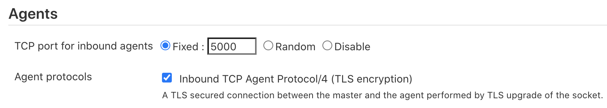

由於預設是使用`Random`的，但如果你是建立在如: AWS、GCP 之類的雲端服務上，通常會讓`Security Group`裡`Inbound`的 Port 越少越好。這裡我們設定`Fixed`的 Port 號為`5000`，並且在`Security Group`開放這個 Port。

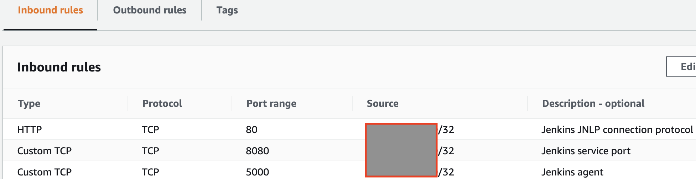

為了只讓特定的機器可以存取這個 Port，也可以在`Source`上加入目標機器的 IP，這樣就可以有效的增加安全性了。

### 建立新的節點

進入`Manage Jenkins`並點擊`Manage Nodes and Clouds`

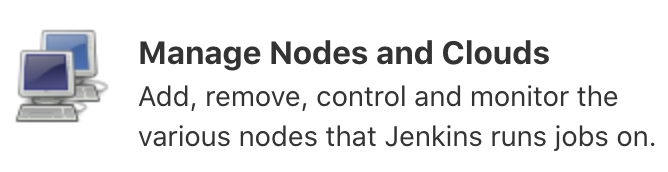

點擊左側`New Node`

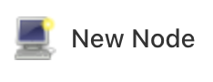

輸入`Node name`及選擇`Permanent Agent`

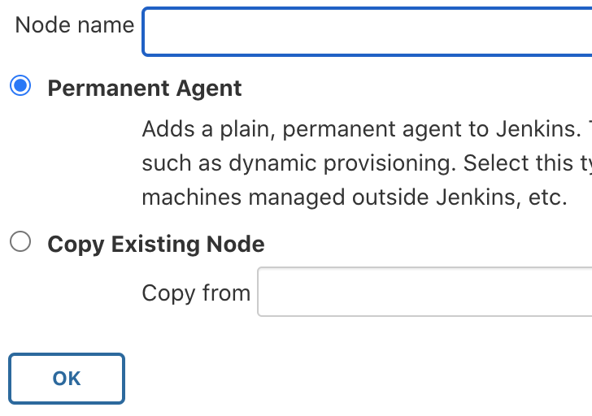

填入必要資訊，如下圖

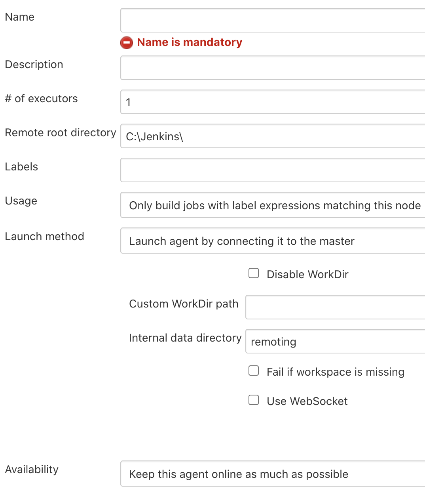

設定 Slave 的工具位置，如: Git...，完成後點擊`Save`

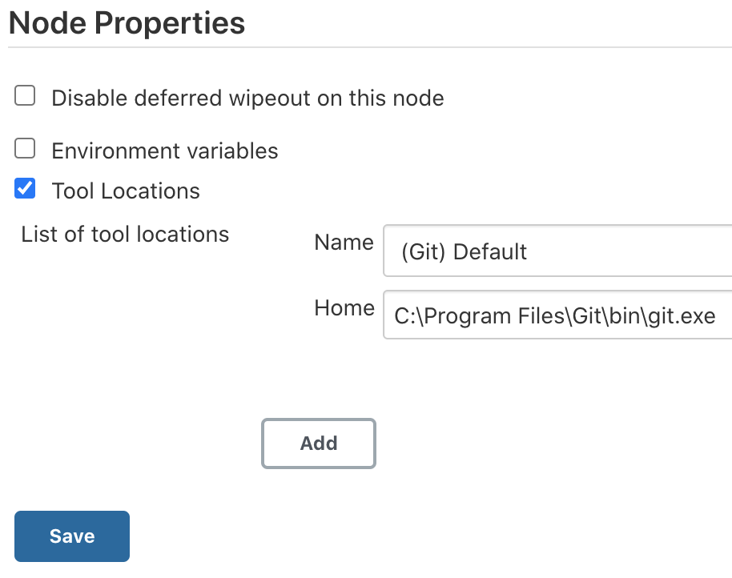

這裡我們會看到一個離線的 Node，請點擊它

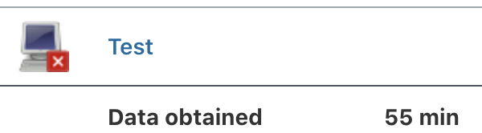

進入後可以看到我們待會需要在 Windows Slave 執行的 Agent 指令

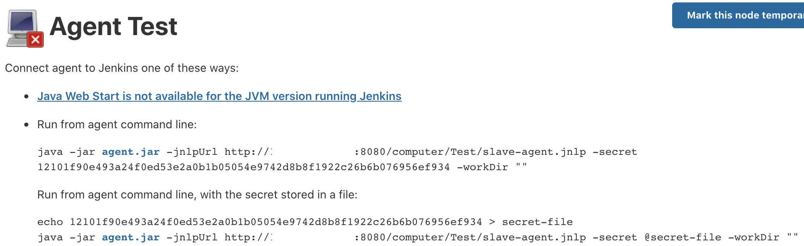

下載`agent.jar`後到此 Master 的部份完成了，接下來讓我們繼續完成 Windows Slave 的設定吧!

## 設定 Windows Slave

接著，我們要在 Windows 上執行剛剛複制下來的指令。我們先將指令寫進腳本檔(powershell 或是 batch)中，方便後續執行。
然後，建立`C:\Jenkins`並且將`jenkins_slave.ps1`及`agent.jar`放進此資料夾。

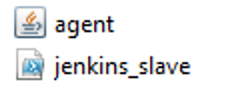

為了避免 Slave 關機或是從開後造成節點失效，我們可以設定`Task Scheduler`，讓系統在啟動時可以自動運行 Agent。
於設定完後直接執行新建的任務並且回到 Jenkins Master。

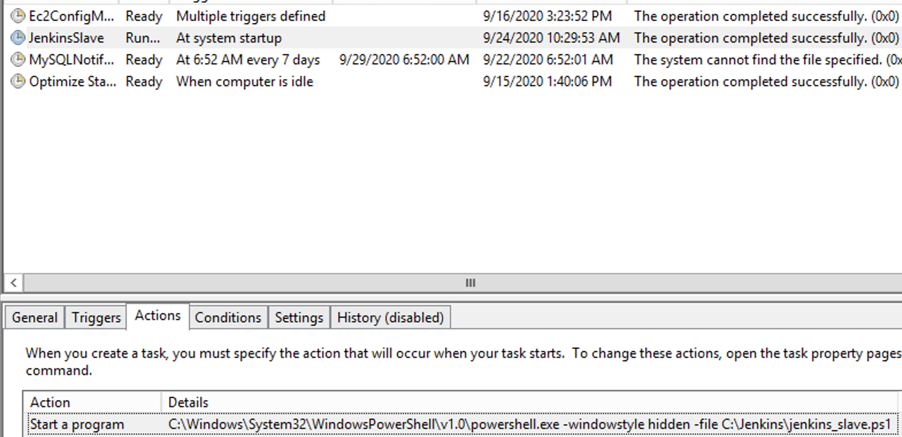

點擊`Refresh status`後，如果有看到 Slave 的資訊，就代表設定成功了!

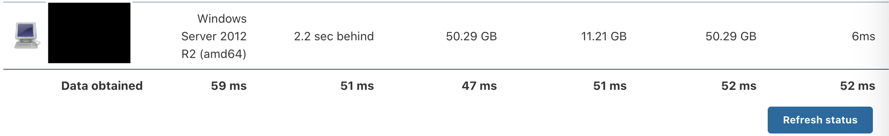

## 下載 nuget.exe

根據[官方文件](https://docs.microsoft.com/en-us/nuget/consume-packages/package-restore#restore-using-msbuild)的說明，Visual Studio 2017 之後的版本已經使用`PackageReference`的方式來引入相依套件，要下載這些相依套件只需要使用`msbuild -t:restore`，但如果是之前的專案這些相依套件會被放在`packages.config`，可參考此[文件](https://docs.microsoft.com/en-us/nuget/consume-packages/package-restore#restore-using-the-nugetexe-cli)。

因為筆者目前的專案有`packages.config`，所以會需要`nuget.exe`這個工具來下載我所需要的相依套件，
可至[此處](https://www.nuget.org/downloads)下載。

restore 的指令為`nuget.exe restore -PackagesDirectory $YOUR_PACKAGES_LOCATION\\packages`

*NOTE:*如果讀者專案跟我筆者的一樣是混合型的，也別忘了使用`dotnet.exe`回復紀錄在`PackageReference`裡面的套件
`dotnet restore --packages $YOUR_PACKAGES_LOCATION\\packages`

## Troubleshoot

### 如何利用 CLI 的方式建置 .Net 專案

```powershell
msbuild.exe $WORKSPACE\\$YOUR_PROJECT\\$YOUR_PROJECT.csproj `
  /p:Platform=AnyCPU `
  /t:WebPublish `
  /p:WebPublishMethod=FileSystem `
  /p:DeleteExistingFiles=True `
  /p:publishUrl=$PUBLISH_DIR\\$YOUR_PROJECT `
  /p:ExcludeFilesFromDeployment="Web.config" `  # 要排除的檔案
  /p:ExcludeFoldersFromDeployment="APP"         # 要排除的資料夾
```

### 如何利用 CLI 的方式建置 .Net Core 專案的

```powershell
msbuild $WORKSPACE\\$YOUR_PROJECT\\$YOUR_PROJECT.csproj `
  /p:Configuration=Release `
  /p:Platform=AnyCPU `
  /p:DeployOnBuild=true `
  /p:ExcludeApp_Data=False `
  /p:SelfContained=False `
  /p:TargetFramework=netcoreapp2.2 `
  /p:TargetRuntime=Portable `
  /p:WebPublishMethod=FileSystem `
  /p:DeleteExistingFiles=True `
  /p:publishUrl=$PUBLISH_DIR\\$YOUR_PROJECT
```

## 總結

這次的任務就像在玩逆向工程，必需花不少時間在了解整個 .Net 的建置過程及無止境的 Try&Error，過程中也學到了不少關於 .Net 的知識。經過這次的任務，我真的覺得我們這些處在這個時代的工程師，真的是太幸福了。因為， IDE 可能已經在啟重的時候就幫我們做掉了不少底層的事情，讓我們可以不用花心思在程式碼以外的事，讓我體會到 DevOps 的重要性，以及讓我更相信我選擇的道路是正確的!

## 參考資料

<https://stackoverflow.com/questions/16303150/how-can-i-run-a-powershell-script-as-a-background-task-without-displaying-a-wind>
<https://wiki.jenkins.io/display/JENKINS/Step+by+step+guide+to+set+up+master+and+agent+machines+on+Windows>
<https://www.edureka.co/community/48364/windows-slave-agent-jnlp-have-jenkins-master-configured-linux>
<https://scmquest.com/jenkins-windows-slave-configuration-with-screenshots/>
<https://stackoverflow.com/questions/58931996/jenkins-pipeline-bat-powershell-encoding-show-umlauts>
<https://stackoverflow.com/questions/24291827/how-to-use-a-jenkins-variable-in-my-powershell-script/24292447#24292447>
<https://www.nuget.org/downloads>
<https://stackoverflow.com/questions/48956184/msbuild-and-package-restore-with-packages-config>
<https://docs.microsoft.com/en-us/nuget/consume-packages/install-use-packages-nuget-cli>
<https://stackoverflow.com/questions/10265869/kill-process-by-filename>
