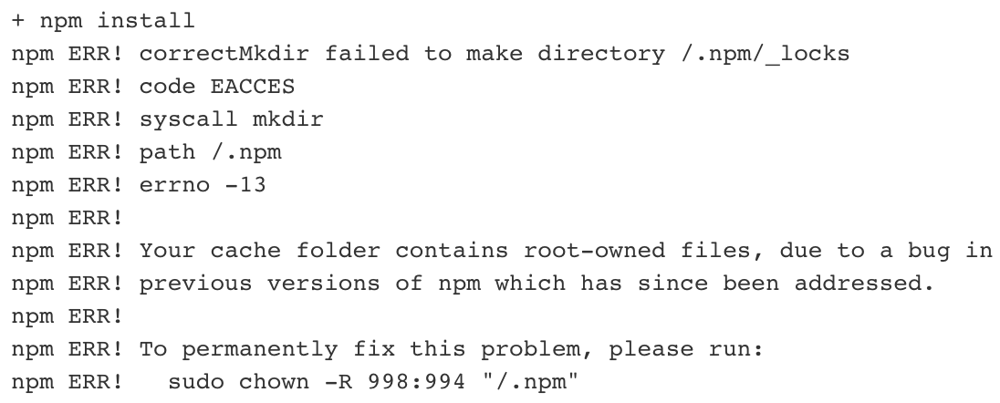

## 前言

我的第一個 DevOps 工作出現了。這邊也是要搭配 Jenkins 建立一個自動化部屬的 Job，可以讓使用者直接一鍵發佈應用程式。

有別於過去使用的方式，這次使用 Docker 來做為建置的環境。[官方](https://www.jenkins.io/doc/book/pipeline/docker/)也有詳細的說明，教導使用者們如何搭配 Docker 來建立一個或多個特定環境來運行建置的過程。

但…，事情永遠不會那麼的順利。

## 問題描述

在讀完官方教學後，一運行我的 Job 就出現下面的問題了



## 解決方法

```Jenkinsfile
pipeline {
    agent {
        docker {
            image 'node:12-alpine'
        }
    }

    // 加這個環境變數就是關鍵!
    environment {
        HOME = '.'
    }

    options {
        timeout(time: 1, unit: 'HOURS')
    }
    ...
}
```

## 總結

Jenkins 整合 Docker 讓使用者更容易創造出乾淨的多重建置環境，使用完後就會把容器給刪除掉，真的還蠻方便的。
對容器化也越來越有興趣了!

## 參考資料

<https://www.thetopsites.net/article/52790764.shtml>
