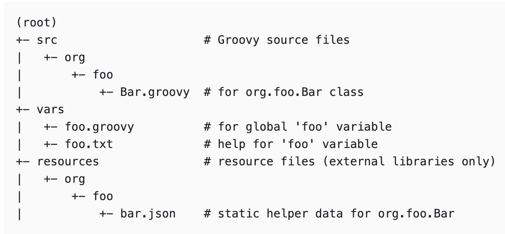
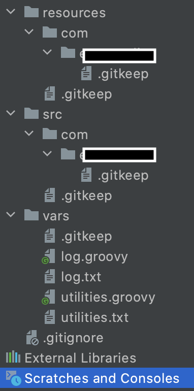
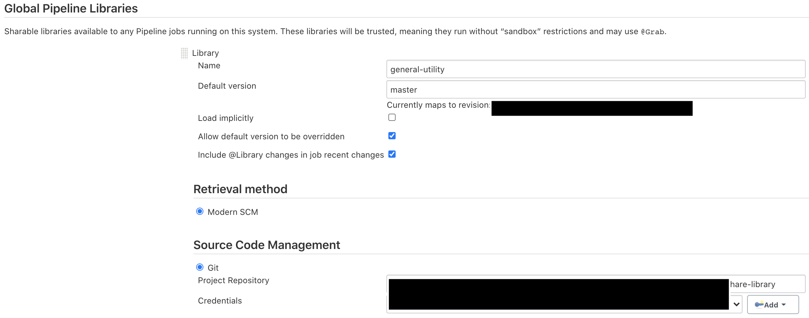
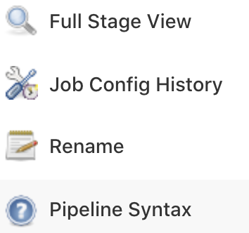
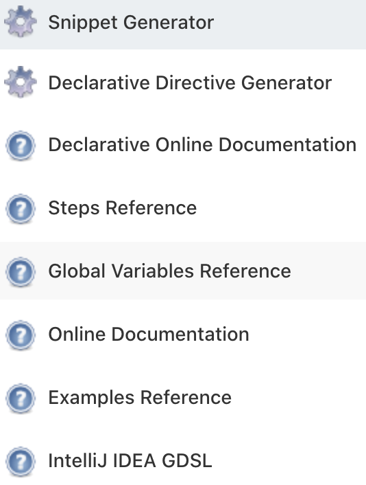
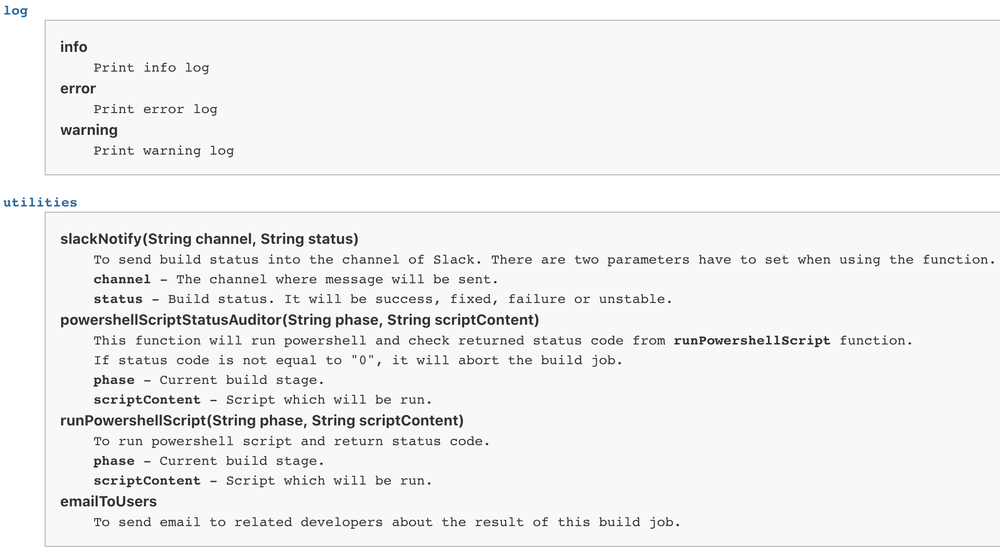

## 前言

為了減少因為複制而造成重複的腳本，Jenkins 提供了[共享函式庫](https://www.jenkins.io/doc/book/pipeline/shared-libraries/)(Share Library)這個功能，讓 Pipeline 也可以使用模組化的方式來減少重複的程式碼。

根據官方文件，Share Library 的資料夾結構必需如下圖



- `src` - 與 Java 的資料夾結構一樣。此資料夾會在 Pipeline 執行時被加入到`classpath`
- `vars` - 裡面的檔案會是以一個`.groovy`及一個`.txt`成對的存在著，例如: utilities.groovy 與 utilities.txt。
  `.groovy`會像一個對外開放的命名空間。亦即`所有在這個命名空間裡的函式`都可以在 Pipeline `引入這個共享函式`後利用這個命名空間直接存取。`.txt`的內容則會針對`.groovy`裡即有的函式加以說明，就像`JavaDoc`一樣。只是…，官網上面說它支援`html`或是`markdown`的語法，但是，我在使用`markdown`的時候一直無法正常顯示，後來就改用`html`的語法了。
- `resources` - 裡面的資料也是全域的，但必需透過`內建的的step` - ` libraryResource`才可以存取。

Jenkins Share Library 的基本說明大概是這樣。接下來就開始建立吧!

## 建立 Jenkins Share Library

Share Library 會是一個獨立的 Git Repo，並且會在設定 Jenkins 時被引入。請根據各自使用的 VCS 建立之。

這裡我覺得常用的功能有發送訊息之類的腳本。我們先建立一個發送 Slack Notification 的功能



這裡產生了資料夾結構並且建立了兩個命名空間`utilities`及`log`，又及各自說明文件。在`utilities`裡面，
我們建立了一個發送 Slack 訊息的函式。

```groovy
/**
 * Slack Notifier
 *
 * To send build status into the channel of Slack
 *
 * @params  channel - The channel where message will be sent
 *          status  - Build status. It will be success, fixed, failure or unstable
 */
def slackNotify(String channel, String status) {
    def colorCode = null

    switch(status) {
        case 'success':
        case 'fixed':
            colorCode = '#00FF00';
            break;
        case 'failure':
            colorCode = '#FF0000';
            break;
        case 'unstable':
            colorCode = '#FFCC00';
            break;
        default:
            colorCode = '#440f3c';
            break;
    }

    slackSend channel: "$channel",
              color: "$colorCode",
              message: "*${status.toUpperCase()}* - ${env.JOB_NAME} #${env.BUILD_NUMBER} (<${env.BUILD_URL}console|Open>)"
}
```

### 建立說文件

接下來，繼續進行說明文件的建立來讓我們的 Share Library 更完整吧!因為`markdown`的方式我目前還沒研究成功，所以這次是先使用`html`的語法。

```html
<b>slackNotify(String channel, String status)</b>
<pre>
    To send build status into the channel of Slack. There are two parameters have to set when using the function.
    <b>channel</b> - The channel where message will be sent.
    <b>status</b> - Build status. It will be success, fixed, failure or unstable.
</pre>
```

這樣就把說明文件完成了，接下來只要讓 Jenkins 把剛剛建立的 Share Library 引入就完成了九成了。

## 設定 Jenkins

進入`System Configuration`後並且點擊`Configure system`，下拉至`Global Pipeline Libraries`，
點擊建立並且填入相關資訊，如:`Name`、`Default version`、`Project Repository`及`Credentials`。



*Note*: 此設定是針對`Git`，如果讀者是使用`Subversion`也可將設定改成`Subversion`即可。

## 引入 Share Library

在 Pipeline 引入`vars/`的函式語法有四種

```groovy
/* Basic */
@Library('my-shared-library') _
/* Using a version specifier, such as branch, tag, etc */
@Library('my-shared-library@1.0') _
/* Accessing multiple libraries with one statement */
@Library(['my-shared-library', 'otherlib@abc1234']) _

/* Dynamically */
library 'my-shared-library' // 這是以 step 的方式呼叫
```

要引入`src/`的類別則需要使用`import`語法。(雖然這個方法也可以用來引入`vars/`底下的函式，
但為了程式碼的簡潔，官方並不建議這樣做)

```groovy
@Library('somelib')
import com.mycorp.pipeline.somelib.UsefulClass
```

最後，建立一個 Job 來測試。引入我們剛剛建立的 Share Library 並且在`stage`裡面呼叫。

```jenkinsfile
@Library('general-utility') _

pipeline {

    stages {
        stage('Test') {
            steps {
                script {
                    utilities.slackNotifier()
                }
            }
        }
    }
}
```

相信各位一定都成功了!這裡就不放圖了XD。

剛剛說過的完整性包括了說明文件，那…，我們剛寫了一堆html的說明文件呢?這部份必需先執行過一次 Build Job 後才會看得到。
它會存在於`Global Variable Reference`。

點擊`Pipeline Syntax`



再點擊`Global Variable Reference`



可以看到剛剛建立的說明就在這裡，看起來就很專業的樣子XD



## 總結

對於正在學習 Jenkins 的朋友們，我個人覺得這個技能是必點的，因為模組化能夠讓你的腳本更精簡且更具有可攜性及可讀性。
Junior(Pay少) 跟 Senior(Pay多) 的差距也常常從這些細節去區分出來的。舉個例吧，假設你有十個函式或是描述是很常在腳本裡出現的，而且又有十個 Job 是被複制出來的，就相當於有將近100個多餘的函式在你的 Pipeline 裡了。

## 參考資料

<https://www.jenkins.io/doc/book/pipeline/shared-libraries/>
