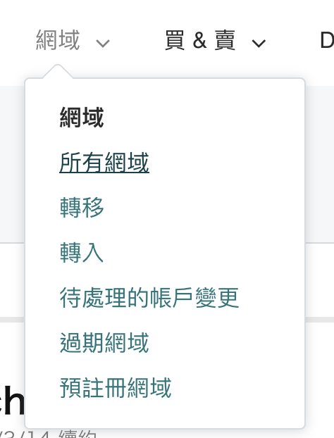
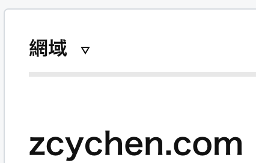
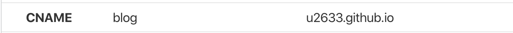
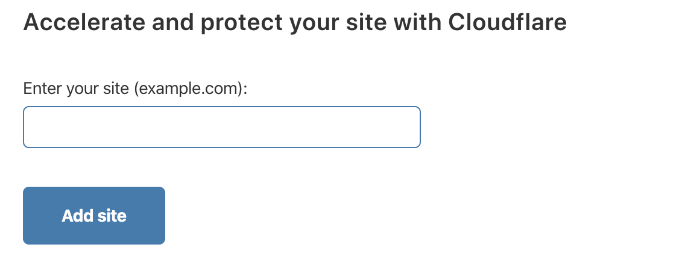
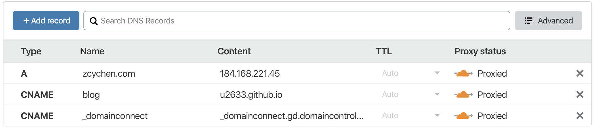
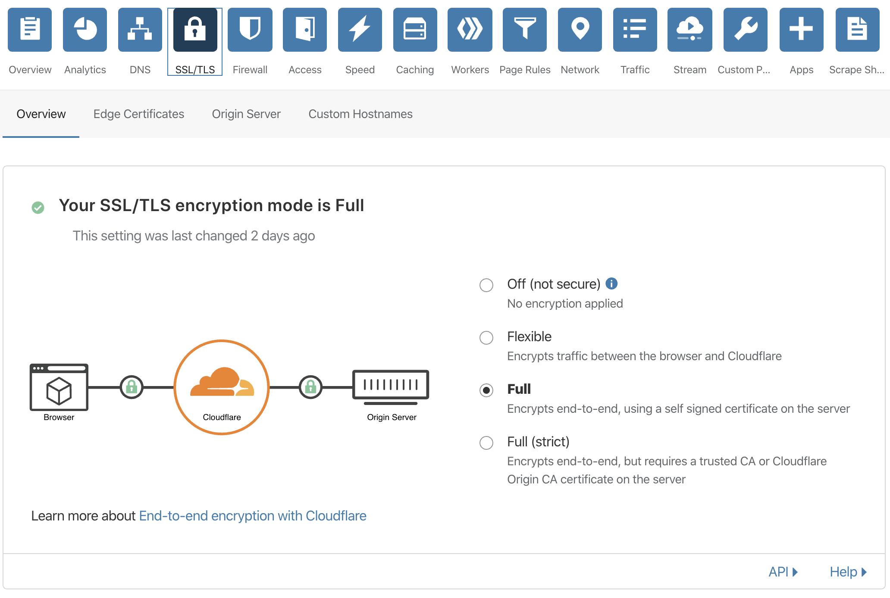
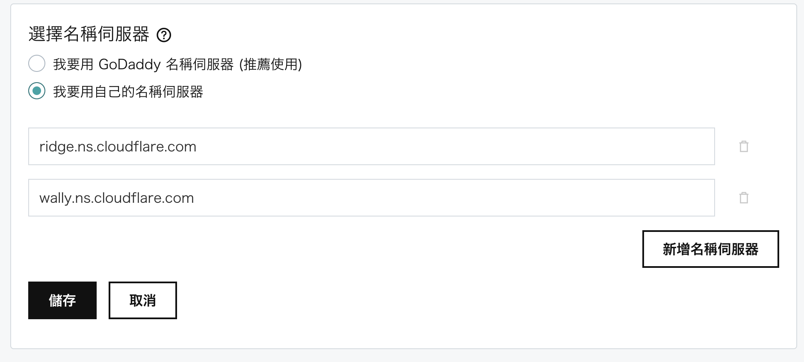

## 前言

在架設完個人 Blog 後，當然也要賦予它一個獨一無二的域名了，我選擇的是 [Goddady](https://dcc.godaddy.com/)的服務，並且使用 [Cloudflare](https://dash.cloudflare.com/) 的免費方案來提供憑證。

## 設定 Goddady

註冊且購買好網域後點擊**`所有網域`**進行設定

進入頁面後，可以看到目前擁有的域名。點擊欲管理的域名進去網域設定頁面

進入網域設定後，點擊 DNS 進入 DNS 管理頁面(`由於我目前的 DNS 已經轉由 Cloudflare 托管，所以下面的紀錄是從 Cloudflare 截圖的`)，接著將自己的 Domain 指向你 Blog 的位置。

## 設定 Cloudflare

註冊後`選擇免費方案`即可。接下來輸入你註冊的網域名稱並點擊`Add Site`

很快就能看到 Cloudflare 處理完後的畫面，如下

接下來設定你的 SSL/TLS。進入頁後，選擇`Full`，Cloudflare 的設定就完成了

## 設定 Goddady 的網域名稱伺服器

因為我們要使用 Cloudflare 的免費憑證，所以 DNS Server 要改成 Cloudflare 的。
進入 Godaddy 的 DNS 管理頁面，並且在網域名稱伺服器功能區塊點擊`變更`(`我的已經變更過了`)

選擇`我要用自己的名稱伺服器`並且填入`ridge.ns.cloudflare.com`及`wally.ns.cloudflare.com`

## 結論

購買一個域名的成本並不會太高，而且其實除了 Cloudflare 之外還有其他服務也有提供免費的憑證，如: [Let's Encrypt](https://letsencrypt.org/) 就是其中之一。所以，只要花點小錢就能給自己的 Blog 一個獨一無二的網名了，很不錯吧!?
