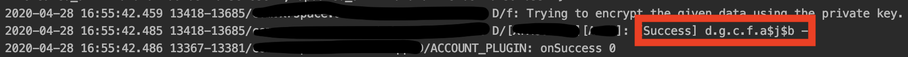
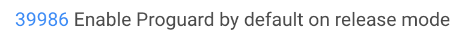

## 前言

最近在更新 Flutter SDK 到 1.12.13 之後，Release 的版本在執行時會報錯，Google 後發現原來是 Proguard 的問題，
來紀錄一下解決的方法吧。

## 問題描述

在 Flutter 升到 Stable 的最新版 - `1.12.13` 之後，build 的過程都很順利，原本想說可以無痛的。
結果，該來的還是躲不過，執行 APP 後居然一直在登入頁面轉圈圈。在交叉比對後發現，
執行 Debug 版本居然是正常的。再來看一下 logcat，找找看錯誤發生的原因。
果然…，就是有錯，而真正造成錯誤居然是被混淆的程式碼，如下:

就之前的經驗，Proguard 應該是手動加入的，這時候第一個直覺先想到的就是，先看一下 1.12.13 的 Release Note，
果不其然，在這個版本的 Relase Note 發現了程式被混淆的原因。

沒錯，由於這個版本的 [R8](https://flutter.dev/docs/deployment/android#shrinking-your-code-with-r8) 預設為開啟狀態，所以，Proguard 在 Release Mode 被設成 `Default` 了。即然知道原因那就好解決…，再次請教大神…。

## 解決方法

解決辨法有兩種，第一種就是在 Build Command 後面多下個 flag - `--no-shrink`，另一種就是在所有的 JNI 函數上下 Annotatin - `@keep`，
去避免程式碼進行混淆的動作。而我是選擇第二種比較合理的作法。

## 參考文件

[Flutter 1.12.13 Release Note](https://flutter.dev/docs/development/tools/sdk/release-notes/release-notes-1.12.13)
[How to fix proguard issue](https://github.com/flutter/flutter/issues/48015#issuecomment-571043492)
[Proguard 教學](https://medium.com/@JamesQI/proguard-d8cc2e67211)

## 結論

雖然這個問題並沒有花費太多時間解進，但這個經驗又讓我學到，要更新工具之前，最好先詳閱它的 Release Note...。
