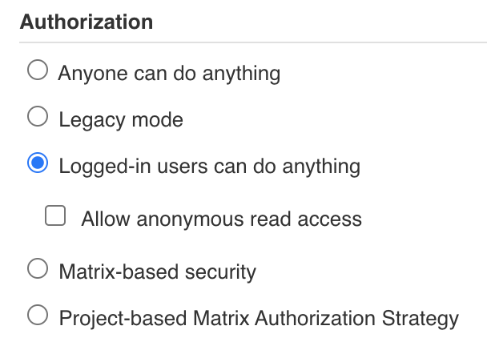
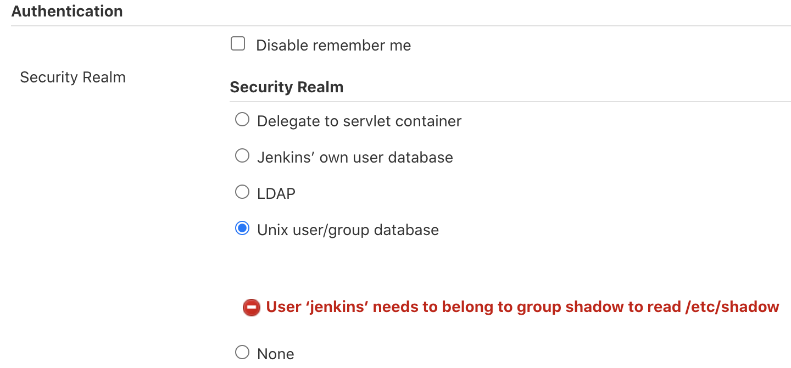
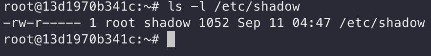
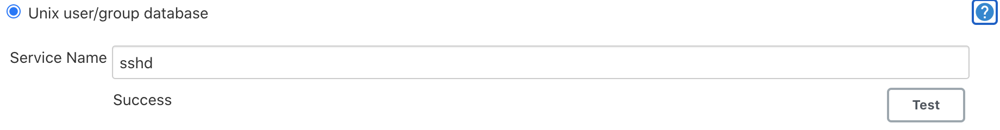
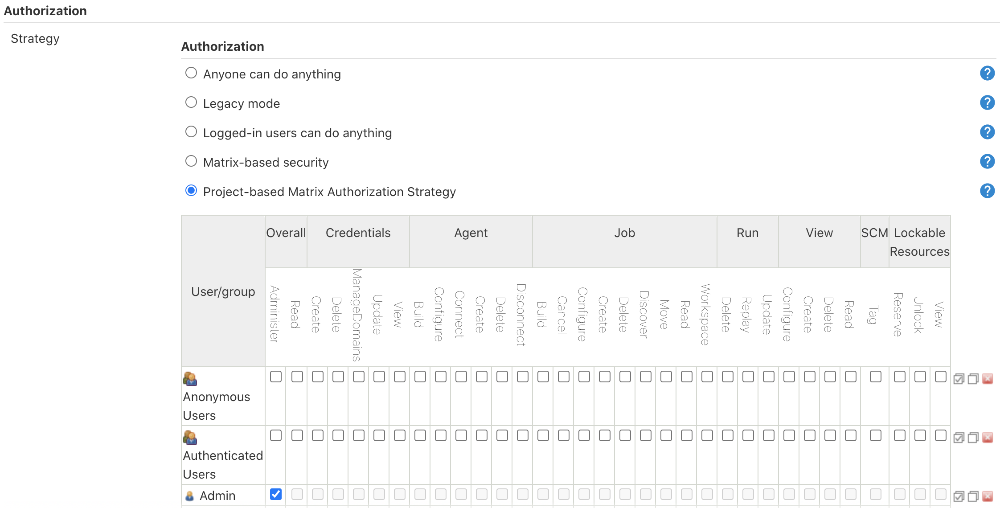
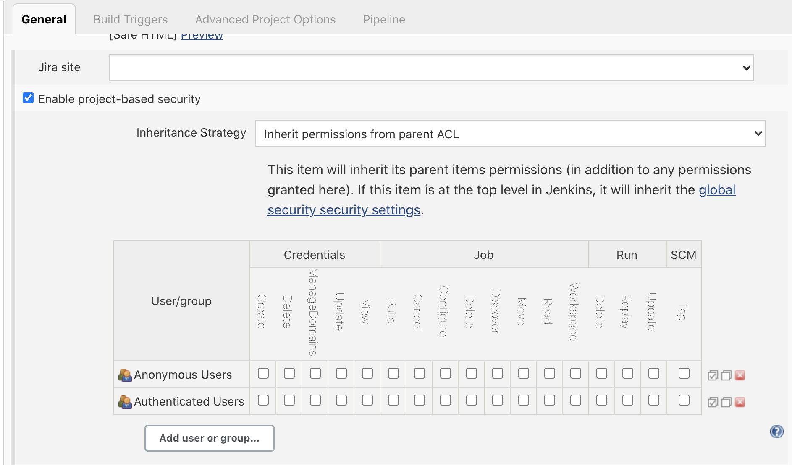
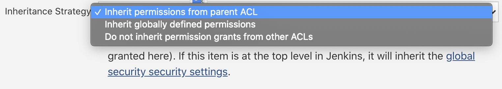

## 前言

相信大家在使用 Jenkins 的時候，大部份的人架設完後並且建立完使用者後，都是直接開始建構自己的 Jobs，
而 Jenkins 的`Authorization`預設值如下圖

從字面可以理解，這代表任何一個使用者都可以進去亂搞。所以，不論你是新人還是~~老屁股~~資深人員，
只要對 Jenkins 有一定的熟悉程度都可以隨意去接觸到這系統更進一步的設定。這樣等同形成了資安的缺口了。

為了避免這種問題，我們最好的方式就是利用群組的設定來賦予使用者能行使的權力。

Jenkins 本身雖然沒有群組的概念，但是可以透過`Unix user/group database`的方式來達成。

`Unix user/group database`是指利用 Unix-Like 系統本身就有的**使用者/群組**的功能，透過運行 Jenkins 的作業系統中，裡面的使用者及群組來做人員管理。讓我看一下如何將這方式達到人員及專案上的管理吧。

## 設定 Jenkins Security Realm

首先，我們先進入`Configure Global Security`把`Security Realm`的設定由`Jenkins’ own user database`變更為`Unix user/group database`並且執行`測試`。如果這是一個相當乾淨的系統，使用者馬上就會遇到第一個問題 - **權限**。

這意思是 Jenkins 並不屬於`shadow`這個群組，所以沒有存取的權限。

參考[官方文件](https://www.jenkins.io/security/advisory/2019-05-21/)及這篇[文章](https://github.com/garbagetown/ansible-jenkins/issues/6#issue-33045278)可以得知，Jenkins 必需擁有`/etc/shadow`的讀取權限。

進入 Jenkins 查看一下這個檔案目前的設定吧。因為筆者是使用 Docker，所以我們先以`root`的權限登入 Jenkins。
執行`docker exec -it --workdir /root --user root 13d /bin/bash`登入並查詢`/etc/shadow`的權限設定。

可以看到目前權限是`640`，只有群組跟擁有者有讀取的權限。這邊我們就直接將`jenkins`這個使用者加入`shadow`的群組吧!
輸入`gpasswd -a jenkins shadow`便完成設定了。登出後再重啟我們的 Container 即可。

進入 Jenkins 的設定頁後，再測試一次我們的設定是否成功。正常情況下，應該看到下圖

## 設定 Host Users and Group

啟用`Unix user/group data`之後，接下來就是建立我們的使用者及群組。

執行`docker exec -it --workdir /root --user root 13d /bin/bash`進入我們的作業系統，
要建立群組，執行`groupadd $GROUP_NAME`，要建立使用者執行`useradd $USER_NAME`或是要建立使用者並加入群組執行`useradd $USER_NAME -G $GROUP_NAME`

## 設定 Jenkins Authorization

完成使用者及群組的建立後，我們再進入`Configure Global Security`的`Authorization`，並且選擇`Project-based Matrix Authorization Strategy`，如下圖。

點擊下方的`Add user or group...`，並且加入剛剛在作業系統中的加入的群組或是使用者，便可以設定其權限。

在這裡的權限是全域的，可以讓我們在 Job Permission 中直接被使用。

如果使用者想要獨立設定 Job Permission ，亦可參考下一章節的說明。

## 設定 Jenkins Job Permission

進入 Job 的設定頁面後，點擊`Enable project-based security`啟用專案安全性設定。

`Inheritance Strategy`有三個選項可供選擇。

第一個選項代表要繼承 Parent Job 的 ACL。如果此 Job 沒有 Parent 就會使用 Global 的設定，也就是第二個選項，第三個選項則是代表不使用任何即有的 ACL 設定。

在選定策略後，亦可以點擊`Add user or group...`如入新的使用者或群且，亦可加入即有的使用者或群組進行 Job 的獨立設定。

## 總結

以`Unix user/group data`的方式設定權限管，對於 Unix-Like 系統比較不熟悉的朋友們，在權限的管理會需要花點時間來了解與學習。但是以群組的方式管理確實也會比較有效率。假設，如果你有 100 個使用者呢?我想光設定就能搞死管理者了吧。

## 參考資料

<https://www.edureka.co/community/47822/there-restrict-permissions-user-per-individual-job-jenkins>
<https://www.jenkins.io/security/advisory/2019-05-21/>
<https://github.com/oracle/docker-images/issues/1336#issuecomment-530789709>
<https://github.com/garbagetown/ansible-jenkins/issues/6#issue-33045278>
