## 前言

筆者之前寫過一篇類似的[文章]( "Group Permission on Jenkins") ，只是使用的是`Project-Based`。但筆者發現，這樣的做法反而增加了管理上的難度，因為**使用者/群組**是在作業系統上的，如果需要增加使用者，便會需要進入作業系統設定，這造成了時間成本，而且筆者使用的是容器化的 Jenkins，這又增加了管理上的難度。

最近剛好發現 Jenkins 上其實還有另外還有一種相對簡單的群組管理方式，而且不需要摸到系統層級，只要在 Jenkins 設定即可。

[Role-based Authorization Strategy](https://plugins.jenkins.io/role-strategy/) - 這就是今天的主角。

接下來就從安裝開始吧!

## 安裝插件及設定策略

我們只需要安裝`Role-based Authorization Strategy`這個插件

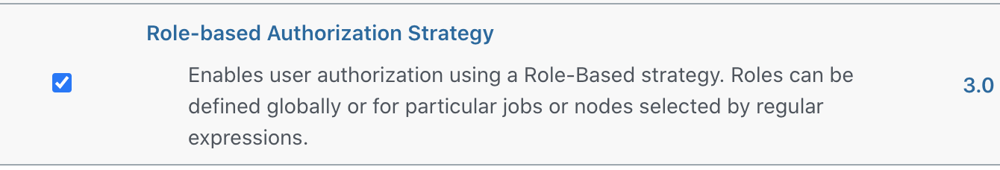

接下來，進入`Configure Global Security`並且設定`Authentication`及`Authorization`的策略。

`Authentication`的部份，我們選擇`Jenkins's own user database`，也就是一開始 Jenkins 的預設選項。

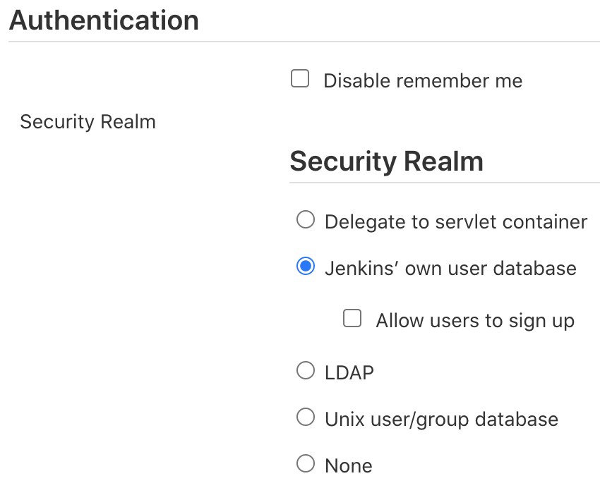

`Authorization`的部份，我們選擇`Role-Based Strategy`。

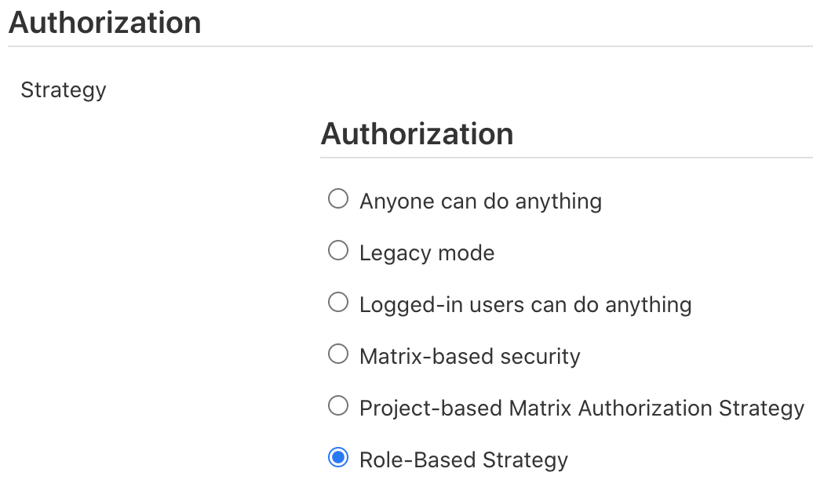

儲存後便啟用了`Role-Based Strategy`了

## 設定角色權限

進結束上一個步驟後，使用者可以在`Manage Jenkins`的頁面最下面方看到`Manage and Assign Roles`的設定選項被啟用了。

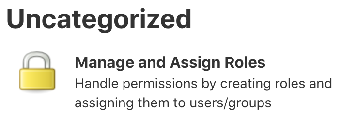

進入設定清單，這裡面有兩個主要的選項，`Manage Roles`及`Assign Roles`。

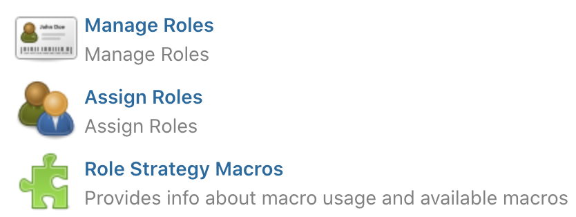

我們必需先建立我們需要的角色及權限後才能做賦予的動作。連擊進入`Manage Roles`。

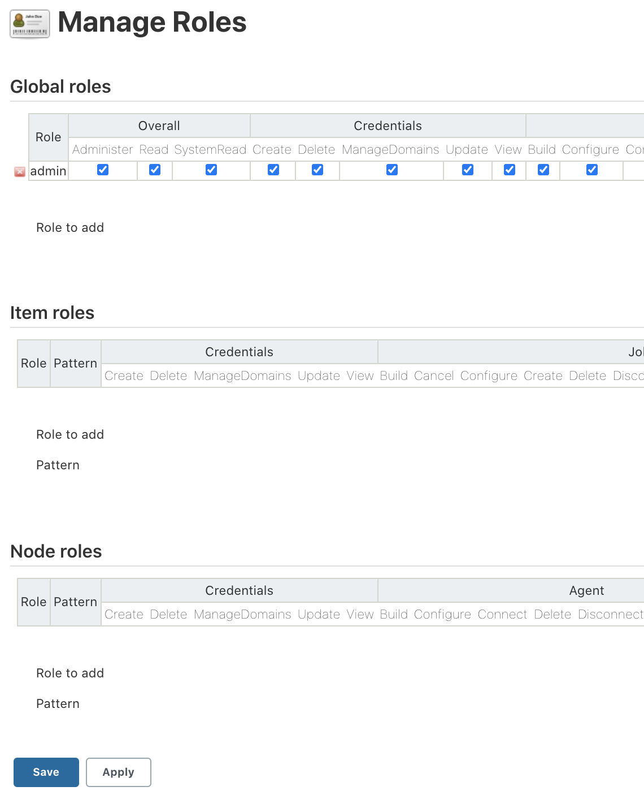

在`Manage Roles`的設定頁面中，我們可以看到有三個選項，分別是`Global Roles`、`Item Roles`及`Node Roles`。

**`Global Roles`**。在此建立的角色是跨專案的。所以，這裡的角色權限不應該開太高。
這裡我們先建一個`Overall Read`的權限，目的是為了讓使用者或群組至少可以有存取 Jenkins 的權限。

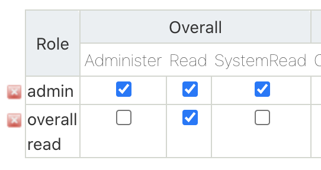

不然就會出現拒絕存取的錯誤

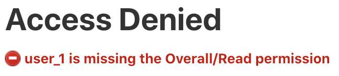

接下來就是針對不同的專案建立不同的角色及存取權限。(筆者已經事先建立了`Test-A-Job`及`Test-B-Job`兩個專案)

在`Item roles`裡面，我們可以開始增加新的角色了。這裡使用者只需要輸入`Role to add`及`Pattern`。
`Role to add`只是對這個角色的描述，這裡我們就叫它`Project A`吧。`Pattern`的部份才是重點，我們可利用 [Regular Expression](https://en.wikipedia.org/wiki/Regular_expression) 來對我們想要設定的專案進行權限控管。

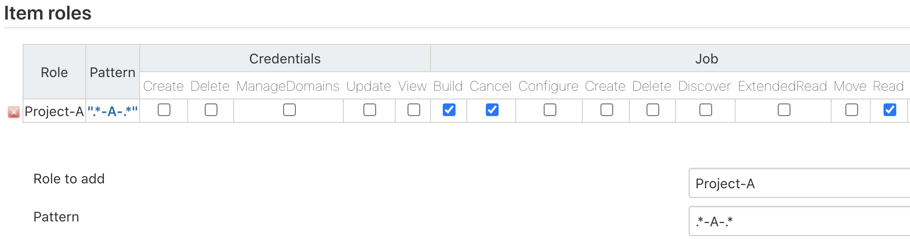

上面筆者使用的 Pattern 是`.*-A-.*`，這代表專案名稱中有包含`-A-`的樣式都會使用此權限控管。

點擊`Pattern`下面的聯結，可以馬上知道哪些專案會被包含進來。

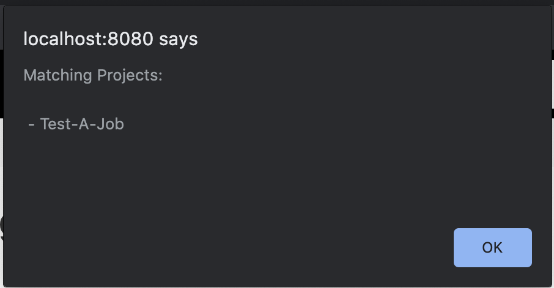

設定完之後，別忘了儲存喔。設定角色後，接下來就是做賦予的動作。

## 賦予角色權限

進入`Assign Roles`後，可以看到剛剛`Manage Roles`設定頁中我們分別對`Global roles`及`Item roles`建立的角色。

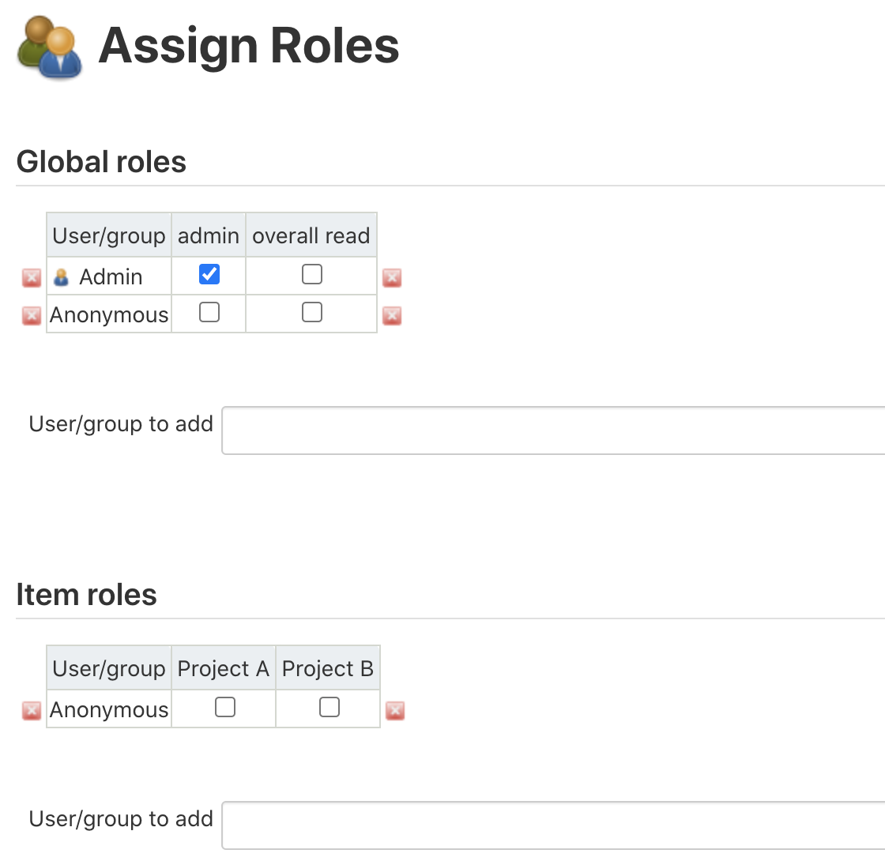

這裡我們可以自行加入**使用者或群組**，但還記得嗎?一開始我們已經將`Authentication`設定成`Jenkins's own user database`了。這代表，我們目前的`Authentication`是沒有群組概念的。當然，如果你是使用`Unix user/group data`的話也是可以直接加入群組的。但筆者認為，Jenkins 這套系統本來就不該被太多非系統管理者觸碰到，就算有也必需是專案的管理者。所以，Jenkins 裡面設定的使用者應該要越少越好，避免資安上的問題。因為上面論述，筆者認為直接使用`Jenkins's own user database`的設定，再搭配`Role-Based Authorization Strategy`來做細部的權限規劃，會是更好的做法。此外，筆者覺得還有另一個好處，但這對有在用 Docker 的使用者會更有感覺，而這好處就是通常在啟用容器的時候，我們會將`jenkins_home`外掛一個`Volume`，這樣就可以把所有的設定儲存在 Host 上，以後要搬到任何地方，只需要把`Volume`做個備份即可。

接下來就是測試每個使用者權限了。我們先看一下權限的配置先。

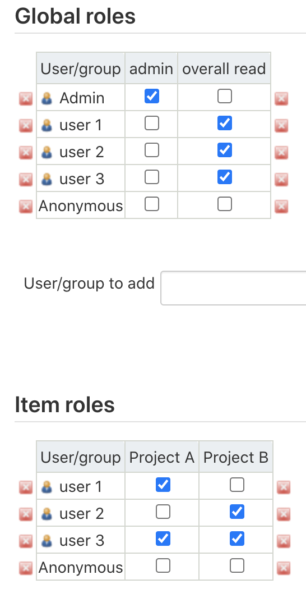

這裡筆者有兩個專案及三個使者並且各別賦予不同的權限。

- `Global roles`裡面，所有角色都`Overall Read`的權限。
- `user_1`僅能存取`Test-A-Job`
- `user_2`僅能存取`Test-B-Job`
- `user_3`則能存取`Test-A-Job`及`Test-B-Job`

我們來看一下`user_1`吧

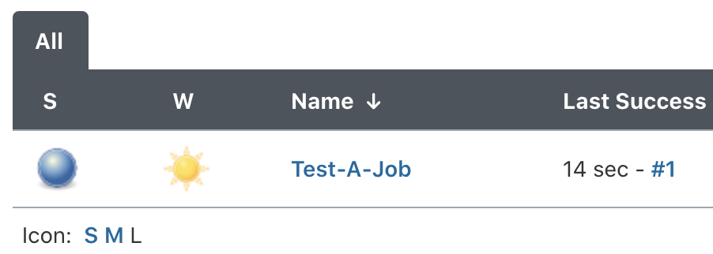

可以登入，而且僅能看到`Test-A-Job`，並且可以正常執行專案的建置

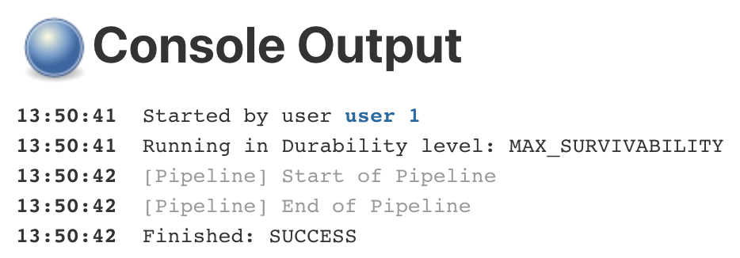

同樣的，登入`user_2`

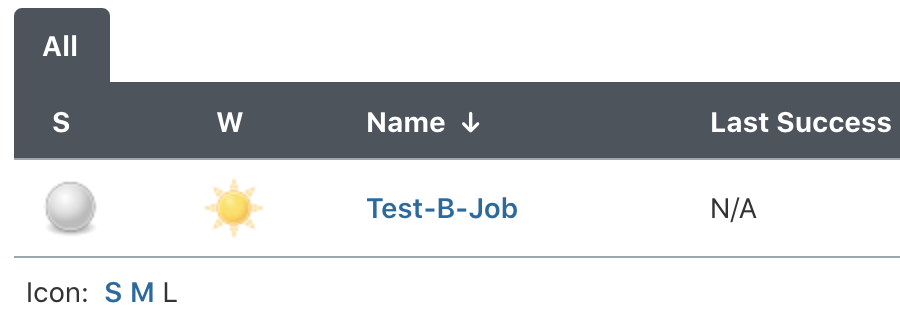

可以登，而且僅能看到`Test-B-Job`，並且也可以正常執行專案建置

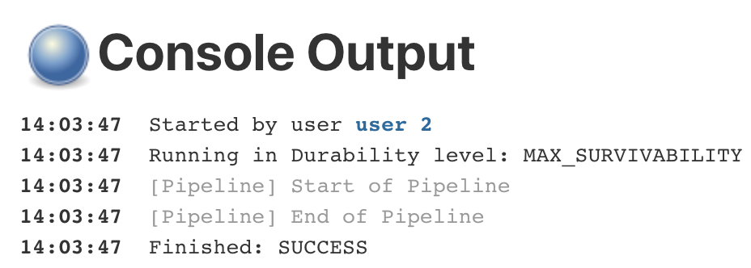

最後登入`user_3`

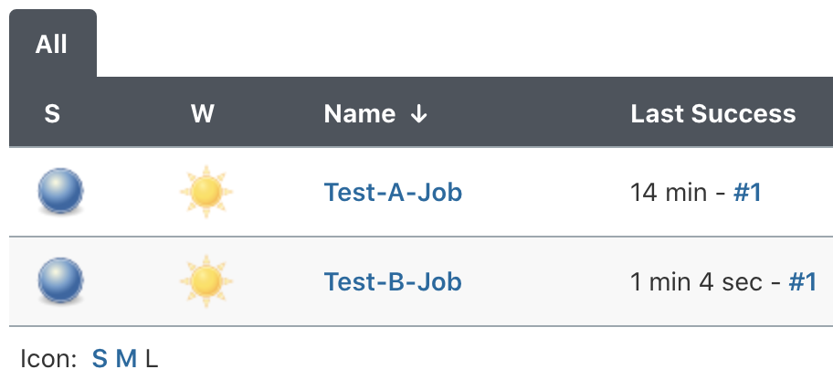

也可正常登入，而且能看到`Test-A-Job`及`Test-B-Job`及正常運行兩個專案的建置

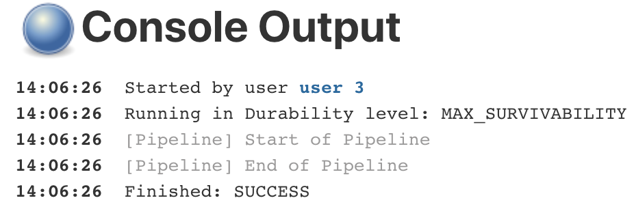
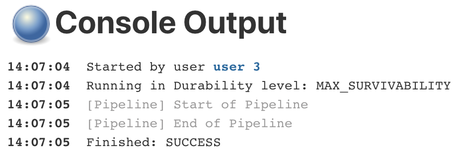

## 總結

基於`Role-Based`的權限控管方式，筆者覺得這對系統層比較陌生的 Jenkins 管理者來說友善多了。
至少，不用花時間在學習及測試系統的使用者或群組，或是為了能夠吃到新的設定值而無止境的重啟 Jenkins 的服務。
可攜性又高，很適合我們這些~~懶人~~工程師使用。

## 參考資料

<https://medium.com/@vishwanathdeedat/jenkins-role-based-access-358936f07af>
<https://www.thegeekstuff.com/2017/03/jenkins-users-groups-roles/>
