## 前言

相信不少 Jenkins 的管理者們都曾為了讓建置的工作可以達到全自動，而在 Job 的設定中啟用過`Poll SCM`這個選項。
這個選項啟用後，我們就可以使用 Unix-Like 的格式設定時間讓 Job 自行運作。

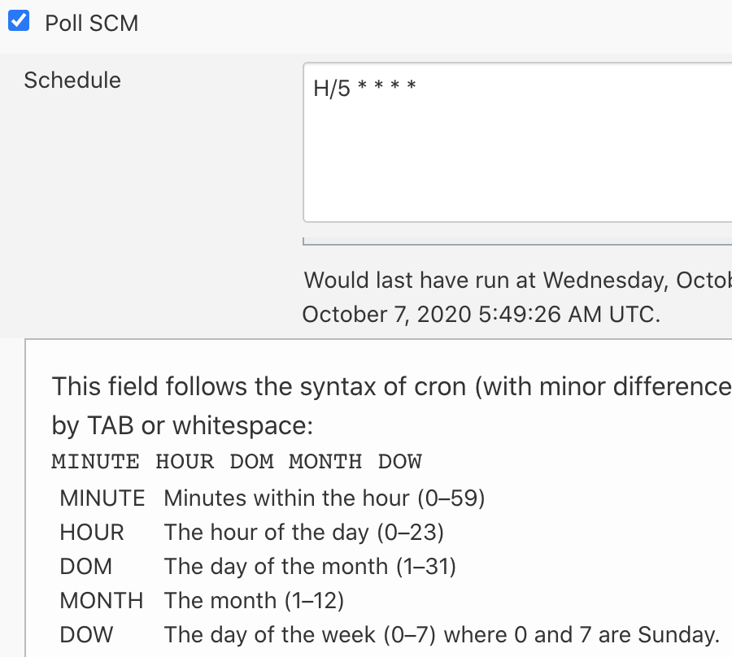

但問題來了，目前 Jenkins 最短的排程只有`1分鐘`，亦就是在排程的欄位裡輸入`* * * * *`，但這就無法達到*即時性*了。
有時候為了趕時間，開發人員還得進來手動觸發，這真的蠻麻煩又浪費開發者們的時間。

所以，這次的任務就是 - **讓 AWS CodeCommit 可以*即時*觸發 Jenkins 的 Build Job**。

流程會是: 開發人員 Push 程式碼至 CodeCommit => CodeCommit 觸發通知 => SNS 發送訊息至 SQS =>
Jenkins 接收到 SQS 訊息後確認 CodeCommit 上有 Code Change 後觸發 Build Job，流程圖如下

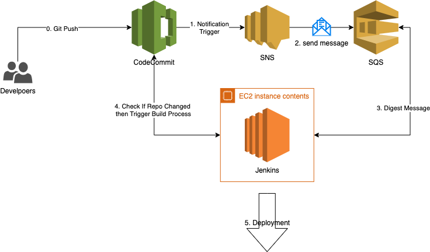

## 設定 AWS

首先，我們需要先建立相對應的 SNS 跟 SQS Topic，讓 CodeCommit 的 Trigger 可以應用到 SNS 的 Topic，
以及讓 SQS 可以訂閱 SNS Topic

### 設定 SNS

進入 SNS 後，點擊建立鈕後，輸入名稱並建立即可

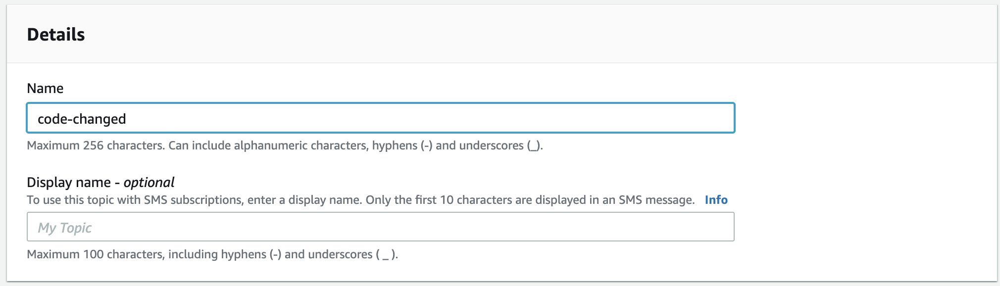

### 設定 SQS

進入 SQS 後，點擊建立後，選擇 Queue 型態並且輸入名稱

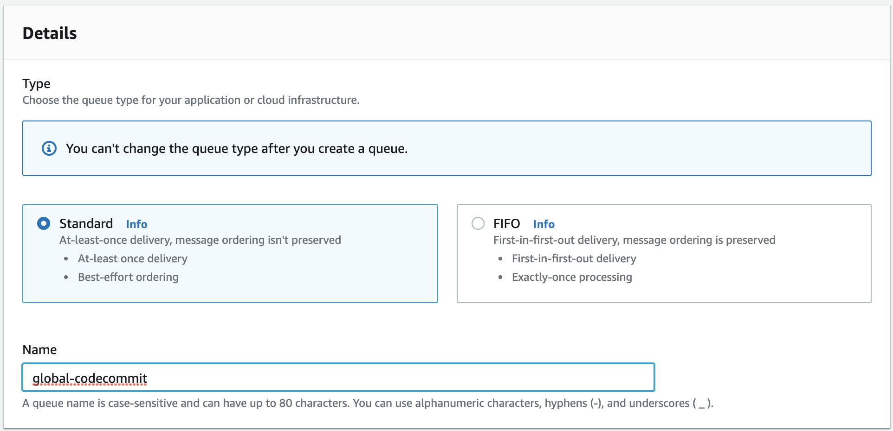

選擇剛剛建立的 SNS Topic，其他設定保留預設後點擊建立即可

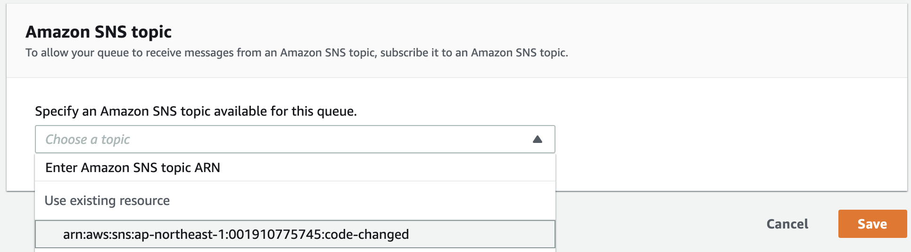

### 設定 CodeCommit

接下來進入 CodeCommit 點擊`Create Trigger`

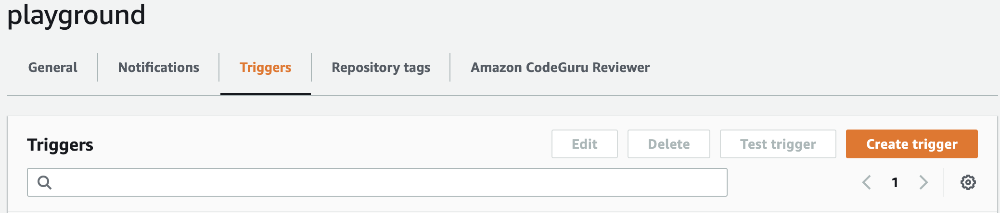

輸入必要欄位

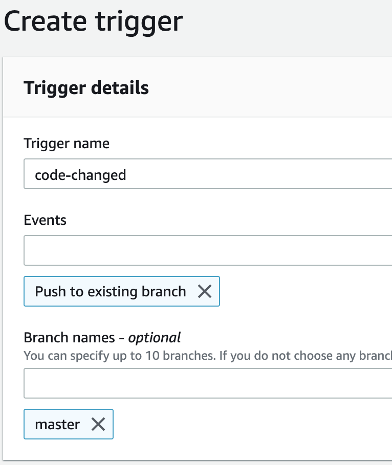

設定 Service Detail

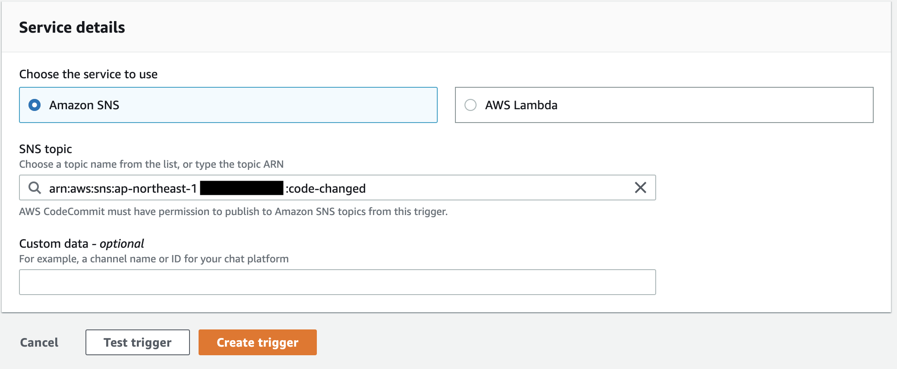

點擊測試

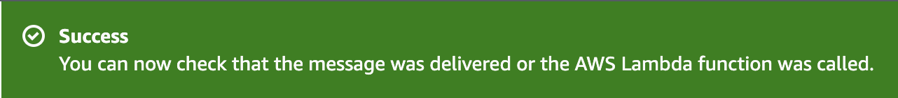

如果看到上面的圖就代表服務串成功

### 測試 Code Changed

這時候我們可以在本地端修改檔案再 Push 到 CodeCommit 測試整個流程是否串通。

在進行 Push 之前，我們先進去 SQS 並且點擊`Send and receive message`來觀察改變。

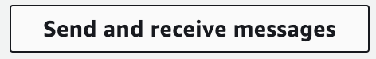

進入功能後點擊`Poll for messages`，這時候會 Queue 會進入接受狀態。

接著在本地端做 Push 觸發 Code Change 的事件

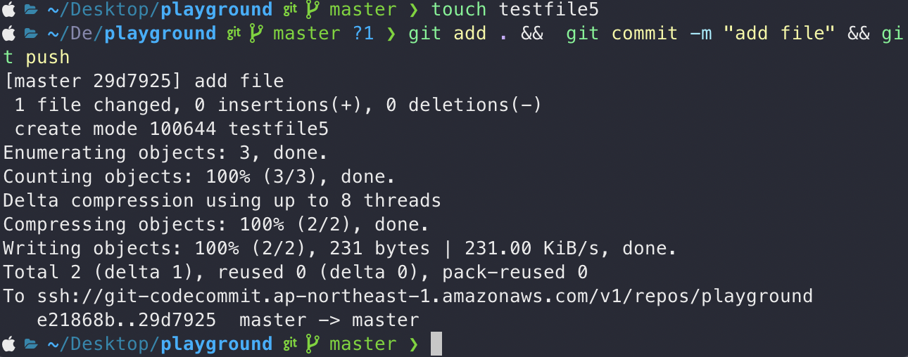

若流程有串通，就會收到如下之訊息

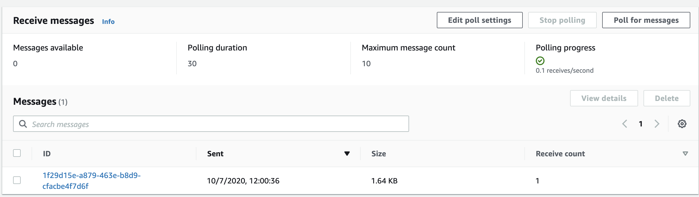

到此，AWS 的服務就完成了，接下來要進入設定 Jenkins 的階段了。

## 設定 Jenkins

在 Jenkins 上我們需要安裝第三方的插件、設定存取的憑證及設定專案。

### 安裝第三方插件

在 Jenkins 上，我們需要借助第三方插件來監聽 SQS 上面的訊息進行觸發，這裡我們用的是[AWS CodeCommit Trigger](https://plugins.jenkins.io/aws-codecommit-trigger/)，安裝完畢後進入`Configue System`下拉至`AWS Code Commit Trigger SQS Plugin`並且完成相關設定後點擊`Test`。

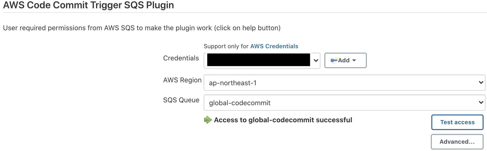

### 設定專案及測試

進入 Build Job 後，啟用`Build when a CodeCommit repository is updated and notifies a SQS queue`並且完成相關資訊的填寫，如下圖

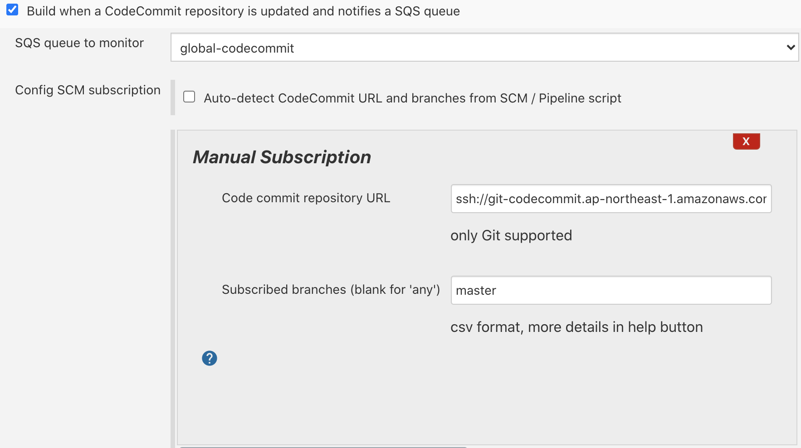

這時候可以進行測試整個完整的流程了，在進行 Code Changed 後，應該要可以看到 Job 被觸發了，
而且也可以看到 Build Job 中 SQS Activity 的活動紀錄

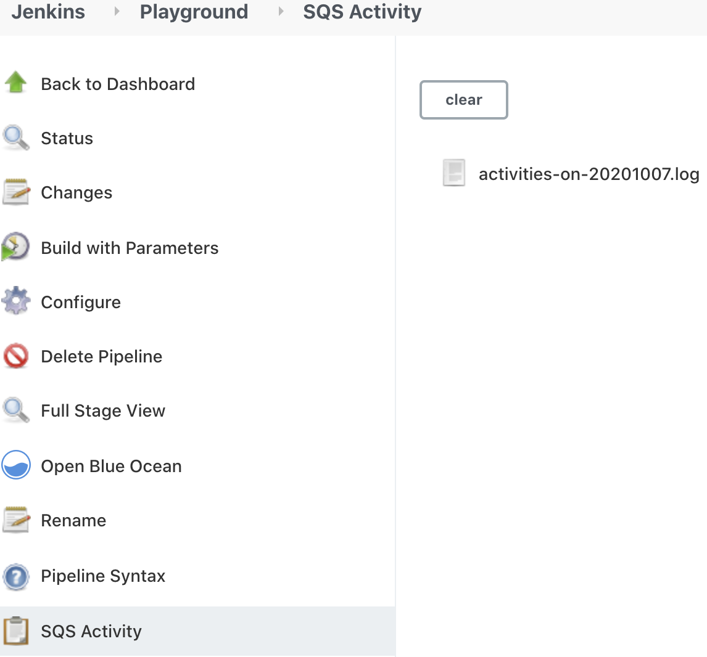

## 總結

這功能我在`AWS Code Commit Trigger SQS Plugin` v3.0.2 之前測試是失敗的，直到最近更新到 v3.0.2 後才正常的，
目前測試也都很正常，觸發也蠻快的(至少，低於 1 分鐘)。

## 參考資料

<https://github.com/jenkinsci/aws-codecommit-trigger-plugin>
