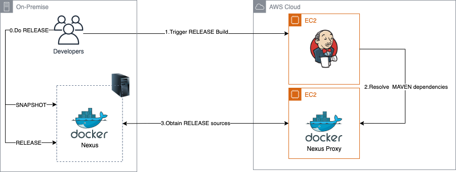
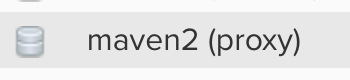
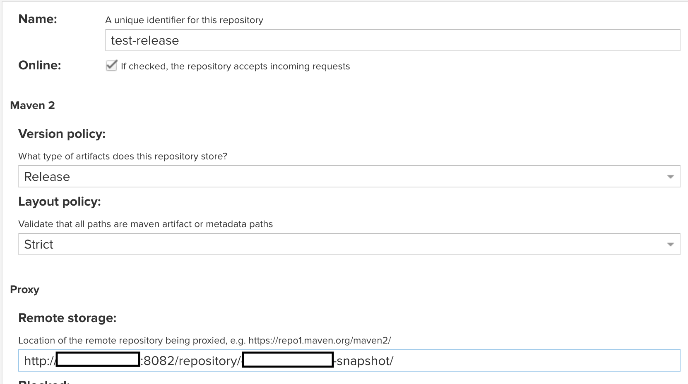
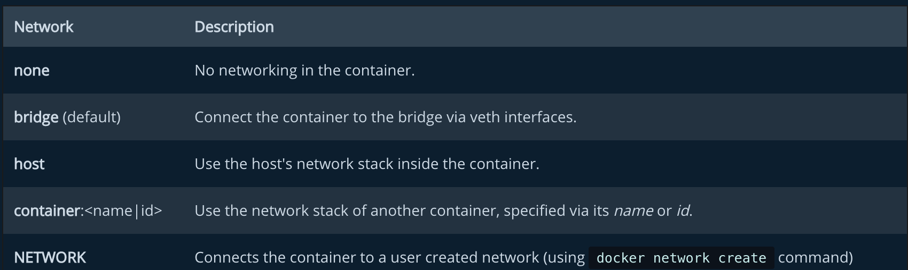
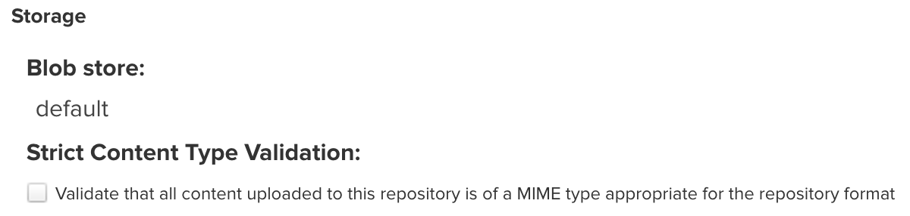
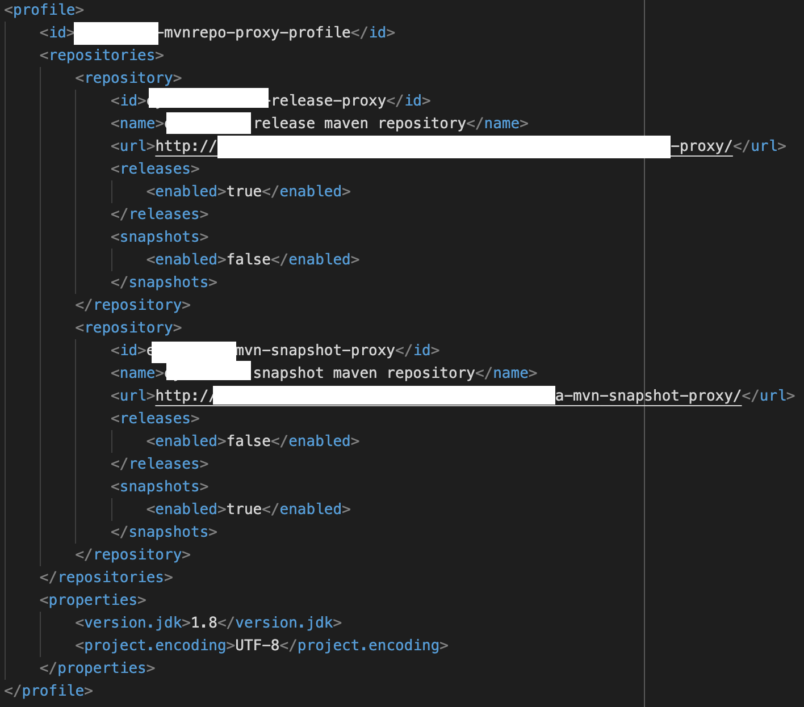
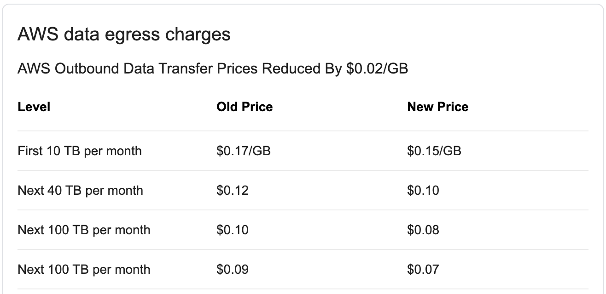

## 前言

在開發 JAVA 的使用者應該都有聽過或使用過 [Nexus](https://www.sonatype.com/nexus/repository-oss) 這套 Artifact Repository 的經驗過。Nexus 不但能夠當 Host，還能作為 Proxy 來存取遠端的 Repository。

由於為了省錢的原故，筆者想了一套AWS的省錢方式，如下圖

接下來，就開始進入實作吧!

## 建立 Proxy Repository

進入 Nexus 後選擇創建新的 Repository 並且選擇`Proxy`作為建立類別

進入設定頁面後填入名稱及遠端儲存的位置後，其他保留預設即可

這時候就可以使用`curl`來試試看是能否成功下載。如果能正常的 Hit 到遠端的檔案就成功了。

*Note:* 我在測試下載的步驟裡一開始是失敗的，但最後找到的原因是由於我的 Proxy 跟 Remote 都是使用容器化服務，
而且，前後共遇到了兩個問題，這些問題的解法紀錄在下一章的`Troubleshoot`裡。

## Troubleshoot

### 解決 502 Bad Gateway

在走完上面的設定步驟後，如果正在看這篇文章的你跟我一樣是使用 Docker 來建 Nexus 的服務，應該也會遇到 502 錯誤。
因為 Docker 預設的網路配置是`bridge`，解法是在建立 Container 的時候加上`--net=host`來解決，這是告訴 Docker 容器要使用的是 Host 的網路堆疊，而不是用橋接的方式。

### 解決 Content Type 錯誤

在解決完 502 錯誤後，我又遇到了`Detected content type [application/x-sh], but expected [application/java-archive]:xxxxx.jar`的錯誤，解決方式是進入 Proxy Repository 裡`取消` Content-Type 的限制即可

## 整合 Nexus Proxy 至 pom.xml(2020/11/10更新)

完成 Proxy Repository 後，接下來就是要將它整合進我們的專案裡了。打開pom.xml後並且建立新的`ActiveProfile`

收工!!!

## 後記

在後來得知內部每個月會從 AWS 拉資料的大小其實不到10G後，就決定直接把 Nexus 整個上雲了。
理由則是，實作的過程時間成本過高。當初覺得能省則省才考慮用此架構，但是發現僅需要花費不到100塊的台幣就能解決的事，我們確花了超過100元台幣的時間成本來解決，實在是不划算阿。

這個經驗也讓我學習到，在設計架構上，`時間成本`絕對要例入考慮呀!

## 參考資料

<https://blog.csdn.net/fenfei1992/article/details/106257407>
<https://github.com/spring-projects/spring-boot/issues/9437>
<https://stackoverflow.com/questions/38346847/nginx-docker-container-502-bad-gateway-response>
