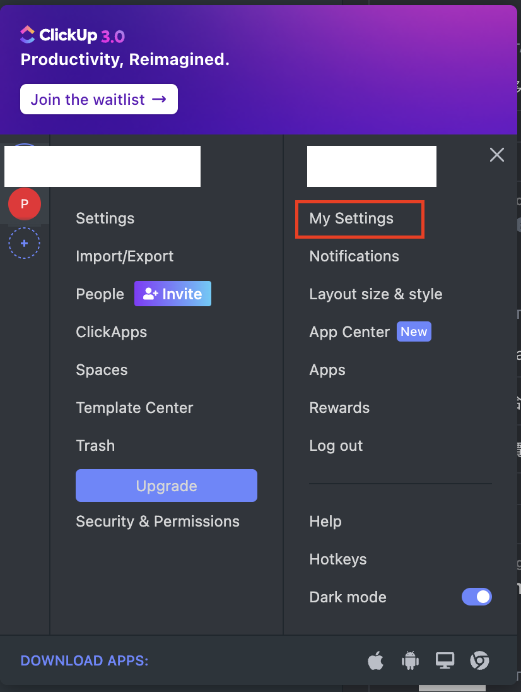
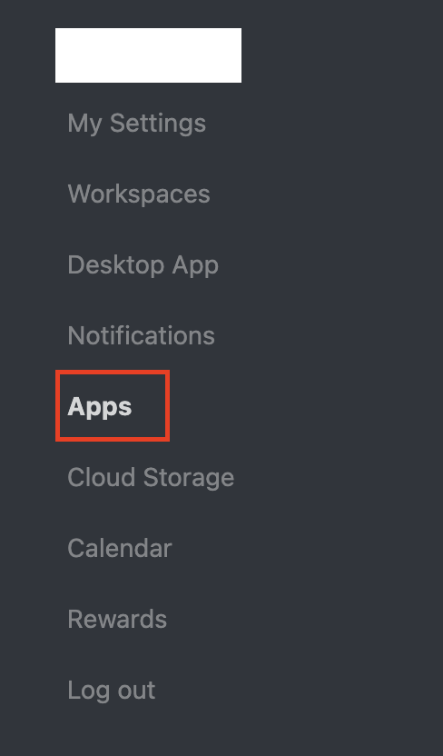
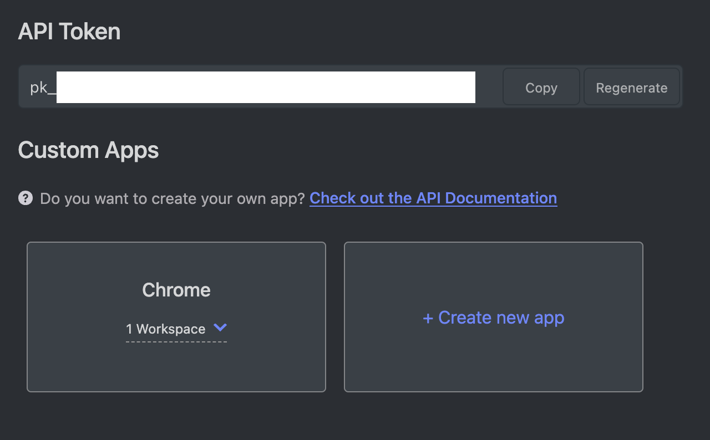
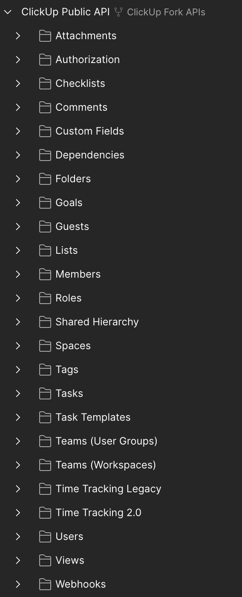
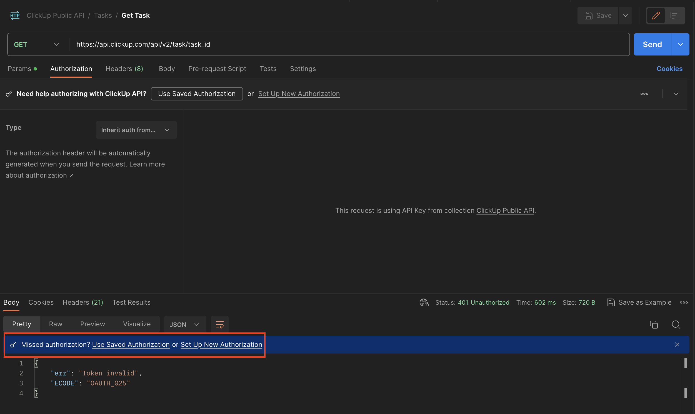
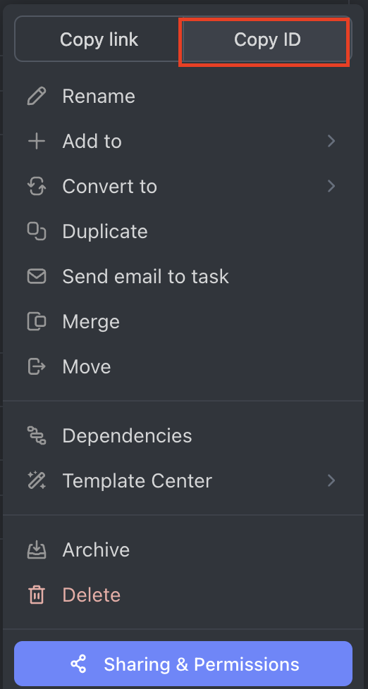
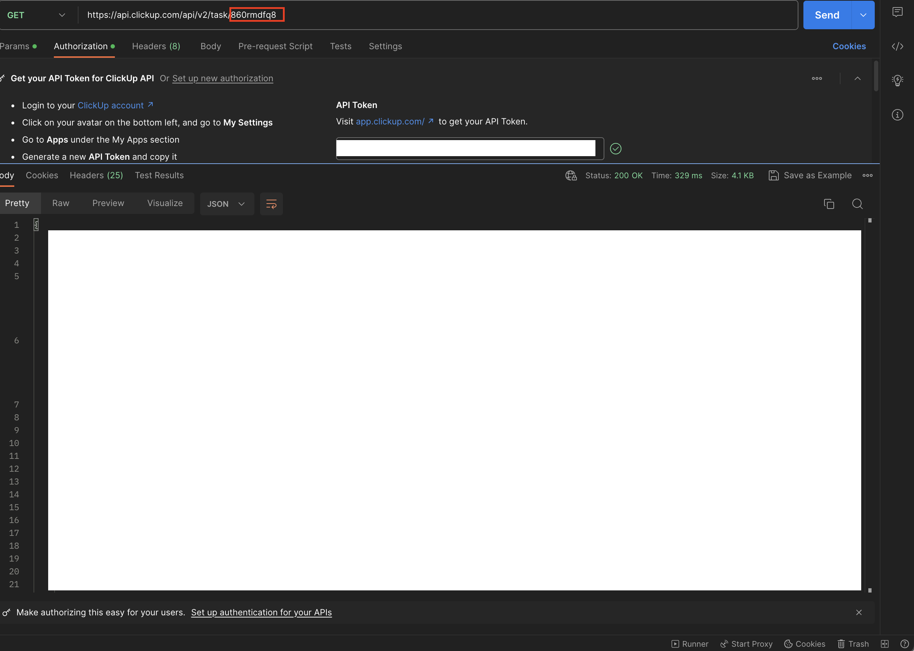

## 前言

[ClickUp](https://clickup.com/) 是一套專案管理的系統工具，裡面包含了一般使用者熟悉的管理工具，如: 看板、任務追踨或是圖表功能。最近因為需求的關係，需要達成自動化的任務，那我們該如何利用官方所提供的方法取得任務資訊呢?

## 取得 Authorization Token

官方有提供 [Public API](https://clickup.com/api/developer-portal/trytheapi/) 的 Postman 給使用者匯入，但需要 [Authorization](https://clickup.com/api/developer-portal/authentication/#authentication) 並提供了 [Personal Token](https://clickup.com/api/developer-portal/authentication/#personal-token) 及 [OAuth Flow](https://clickup.com/api/developer-portal/authentication/#oauth-flow)，因為只是內部自動化流程使用，所以選擇 `Personal Token`。

產生 `Personal Token` 的步驟如下:

- 進入個人設定

- 點擊 `Apps` 頁簽

- 產生 `Token`

## Enjoy It

匯入後的 `Public API` 如下

將產生的 `Token` 填入 `Authorization` 的 `Header`。如果不曉得怎麼代入的話，可以先隨便打一支 `API`， `Postman` 會給予提示。

從 `ClickUp` 複制 `Task ID`

將 `Task ID` 取代後就可以取得任務的訊息了!!!:smiley:

