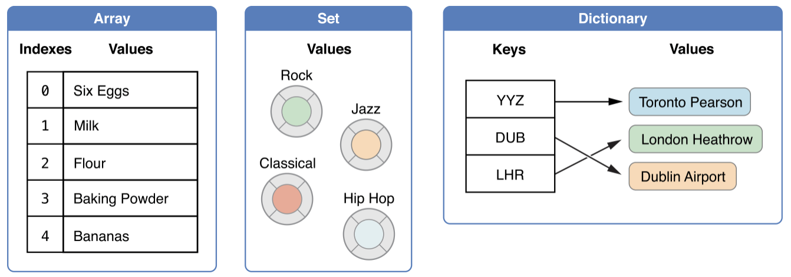

## 前言

終於開始了我`正式`的 SWIFT 學習之路，會說正式是因為在過去片段學習的日子裡，我只是看著[官方文件](https://docs.swift.org/) 並照著各個章節的順序以`看`的方式並試著理解文章內容預讀罷了。但是，在瀏覽過網路上許多人的學習方式，我的總結是`做筆記`。
因為，做筆記一方面是為了紀錄所學，另一方面是為了能夠把所學利用描述轉化成自己的知識，而且會儘量以能讓人容易理解的文字加以描述。
這個做法的好處一方面能讓自己在未來的日子裡要復習時更有印象，另一方面可以讓其他使用者在看文章的時候也能快速理解。
但是，關於`如何有效的做筆記`我也仍然還在學習，或許之後也會寫另一篇文章關於這方面的。

## 宣告

### 變數與常數

Swift 只有兩種宣告型態，一種是*變數*以`var`做前綴的方式，另一種就是*常數*以`let`為前綴

```swift
var a = 10  // 可以重新賦值
let b = 20  // 不可以重新賦值
```

### 型別註解

宣告時如果已經確定型別也可以直接賦予型別

```swift
var a: Int = 10
let b: Double = 20.0
```

### 型別推斷

一般宣告方式如果沒有`型別註解`，Swift 會主動幫我們做判斷，稱為`型別推斷`

### 變數名稱

Swift 的命名可以使用`Unicode`來命名。所以，我們亦可以使用繁體中文做為命名方式

```swift
let Ω = "omega"
let 狗 = "🐶"
```

### 型別轉換

Swift 是個強型別的語言。所以，在做非同型別的計算時必需使用轉型語法。

```swift
let a: Int = 10
let b: Double = 10.0

let c = (Double)a + b
```

### 匿名型別

有時候為了可讀性，我們可以使用`匿名型別`來開發。

```swift
typealias Age = Int

let age: Age = 10
```

## 基本型別

### 整數

整數在宣告時會根據不同的平台自動使用成`Int32`或是`Int64`，並且也具有*有號整數*`Int`與*無號整數*`UInt`

```swift
let minValue = UInt8.min  // 0
let maxValue = UInt8.max  // 255

let minIntValue = Int8.min  // -128
let maxIntValue = Int8.max  // 127
```

### 浮點數

`Double`為 64 位元，`float`為 32 位元

```swift
let pi: Double = 3.1415926535
let weight: Float = 66.8
```

### 布林值

與其他程式語言一樣，也是以`true`或`false`為值。比較值得一提的是，在 Swift 裡的 if...else
描述句裡，條件判斷式的值僅能是`布林值`

```swift
let isTrue = true
let isFalse = false

if isTrue {
  // 可以正常執行
}

if 1 {
  // 發生錯誤 'Int' is not convertible to 'Bool'
}

```

### 元組

元組為多個值組合而成的群組型別。

```swift
let http404Error = (404, "Not Found!")
// equal to
let http404Error:(Int, String) = (404, "Not Found!")

// 解構賦值
let (justTheStatusCode, _) = http404Error

// 存取元組
http404Error.0  // 404
http404Error.1  // "Not Found!"

// 宣告並賦予元素名稱
let http200Status = (statusCode: 200, description: "OK")
http200Status.statusCode  // 200
http200Status.description // "OK"
```

## Optional 宣告

Swift 在宣告時必需明確給予值。但如果我們的變數是在後來才被賦值的話，就必需宣告成`Optional`型別

```swift
let s: String?
s = "new string"
```

### Nil-Coalescing 運算元

一般的三元運算為`a != nil ? a! : b`。Nil-Coalescing 的語法為`a ?? b`，如果`a`有值則返回`a`，
反之則返回`b`

## 範圍運算子

### Closed Range

語法:`1...5`，迭代`1~5`

```swift
for index in 1...5 {
    print("\(index) times 5 is \(index * 5)")
}
```

### Half-Open Range

語法:`1..<5`，僅迭代`1-4`

```swift
for i in 0..<5 {
    print(i)
}
```

### 單向範圍

語法:`...`

```swift
let names = ["Anna", "Alex", "Brian", "Jack"]

for name in names[2...] {
    print(name)
}
// Brian
// Jack

for name in names[...2] {
    print(name)
}
// is equal to
let range = ...2
for name in names[range] {
  print(name)
}

// Anna
// Alex
// Brian

for name in names[..<2] {
    print(name)
}
// Anna
// Alex
```

## 字串與字元

字串為`值型別`。
字串可以多行並且保留原始格式

```swift
let s: String = """
你好
   這是第二行，且啟始位置有兩個空格
這是第三行
"""
```

## 集合型別

Swift 有三種集合型別，`Array`、`Set` 及 `Dictionary`，關念也與其他語言一樣。



集合型別預設為`可修改(mutable)`狀態，如果要令其成員無法被修改，僅需要使用`let`宣告

```swift
let a = [String]()        // array
let s = Set<Character>()  // set
let d = [Int: String]()   // dictionary
```

### 陣列(Array)

陣列原始宣告語法為`Array<TYPE>()`，短語法為`[]`

```swift
var a1 = Array(repeating: 0.0, count: 3)   // 原始語法
var a2 = [0.0, 0.0, 0.0]                    // 短語法
```

陣列相加可以得到新的陣列

```swift
let a1 = [1, 2, 3]
let a2 = [3, 4, 5]

let a3 = a1 + a2 // [1, 2, 3, 4, 5]
```

若是想迭代陣列元素，可以直接存取元素或是以**列舉**(`enumerated`)的方式取得`索引值`及`元素`

```swift
// 直取
for item in someArray {
  print(item)
}

// 列舉
for (index, value) in someArray {
  print("Item \(index + 1): \(value)")
}

```

### 集合(Set)

一種`無序`且僅具有`唯一值`的集合型別。宣告語法為`Set<TYPE>()`，

```swift
let set1 = Set<Int>()           // 空集合
let set2: Set<Int> = [1, 2, 3]  // 字面值
```

Set 可以做`交集(intersection)`、`聯集(union)`、`差集(subtracting)`及`對稱差集(symmetric difference)`

```swift
let oddDigits: Set = [1, 3, 5, 7, 9]
let evenDigits: Set = [0, 2, 4, 6, 8]
let singleDigitPrimeNumbers: Set = [2, 3, 5, 7]

// intersection
oddDigits.intersection(evenDigits).sorted()

// union
oddDigits.union(evenDigits).sorted()  // [0, 1, 2, 3, 4, 5, 6, 7, 8, 9]

// subtracting
oddDigits.subtracting(singleDigitPrimeNumbers).sorted() // [1, 9]

// symmetric difference
oddDigits.symmetricDifference(singleDigitPrimeNumbers).sorted() // [1, 2, 9]
```

### 字典(Dictionary)

以`唯一鍵值(key)`與`值(value)`組合而成的集合型別。原始宣告語法為`Dictionary<Key, Value>`。

```swift
var d1 = [Int: String]()    // 空字典
var d2 = ["1": 1, "2": 2]   // 字面值宣告
d2 = [:]                    // 清空字典

// 迭代字典
for (k, v) in d2 {
  print("\(k): \(v)")
}
```

## 流程控制

### For-In

For-In 可以忽略迭代的值

```swift
for _ in 1...5 {
  print("hi")
}
```

### While

與其他語言相似，差別只在 Swift 中的條件式都只能接受布林值(Bool)，也就是 True/False，
不然會報錯。

```swift
let condition = true
while condition {
  print("Hello")
}
```

### Repeat-While

有些語言叫`do...while`，但其目的都一樣，一定會執行一次程式區段。

```swift
let condition = true
repeat {
  print("Hello")
} while condition
```

### If

其判斷式也僅接受布林值(Bool)

```swift
let condition = true
if condition {
  print("Hello")
}
```

### Switch

Switch 判斷式讓我覺得很彈性變得更大且運用得當的話，反而能讓程式碼更簡潔。

基本語法會自動跳離(`break`)執行成立的區段

```swift
let c = "z"
switch c {
  case "a":
    print("a")
  case "z":
    print("z")
  default:
    print("unknown")
}
// print "z"
```

具有多個相同狀態的條件

```swift
let c = "Z"
switch c {
  case "a":
    print("a")
  case "z", "Z":
    print("z")
  default:
    print("unknown")
}
// print "z"
```

區間匹配

```swift
let i = 52
switch i {
  case 0:
    print("0")
  case 1..<25:
    print("1~25, not include 25")
  case 25..<50:
    print("25~50, not include 50")
  case 50..<100:
    print("50~100, not include 100")
  default:
    print("not in the range of number")
}
// print "50~100, not include 100"
```

元組(Tuple)條件式

```swift
let point = (1, 1)
switch point {
  case (0, 0):
    print("\(point) is at the origin")
  case (_, 0):
    print("\(point) is on the x-axis")
  case (0, _):
    print("\(point) is on the y-axis")
  case (-2...2, -2...2):
    print("\(point) is inside the box")
  default:
    print("outside!")
}
```

若有使用條件式的數值需求，可使用`數值綁定`功能實現

```swift
let point = (2, 0)
switch point {
  case (let x, 0):
  case (0, let y):
  case let (x, y):
}
```

在使用`數值綁定`後可再利用`where`進行條件判斷

```swift
let point = (1, -1)
switch point {
  case let (x, y) where x == y:
    print("(\(x), \(y)) is on the line x == y")
  case let (x, y) where x == -y:
    print("(\(x), \(y)) is on the line x == -y")
  case let (x, y):
    print("(\(x), \(y)) is just some arbitrary point")
}
```

如需讓下一個`case`執行，只需要在執行區塊中最後加入`fallthrough`關鍵字

```swift
let i = 5
switch i {
  case 5:
    print("it is 5")
    fallthrough
  default:
    print(" and it is end")
}
// print "it is 5 and it is end"
```

### 標簽陳述

標簽陳述(Labeled Statements)可嵌套在`條件判斷式`或是`迴圈`中

```Swift
myLabel: if true {
    for _ in 1...1000 {
        for _ in 1...1000 {
            print("hello")
            break myLabel
        }
    }
}

if true {
    myLabel: for _ in 1...1000 {
        for _ in 1...1000 {
            print("hello")
            break myLabel
        }
    }
}

myLabel: while true {
    print("hello")
    break myLabel
}

// 上述三個標簽陳述句結果都僅列印一次"hello"
```

### Guard

簡單說，`Guard`就是一種反向的`if`，也就是`條件不成立則執行程式區塊`，只是與`if`的差別在於永遠會有`else`區塊
以及`guard let`後的常數可以在後續使用，但`if let`後的常數僅能使用在執行區塊內

```swift
func greet(person: [String: String]) {
  guard let name = person["name" ] else {
    return
  }

  print("Hello \(name)")

  guard let location = person["location"] else {
    print("I hope the weather is nice near you.")
    return
  }
  print ("I hope the weather is nice in \(location).")
}

// multiple guard

guard let a = a1, let b = b1, let, c = c1 else {
  return
}
```

### API 可用性檢查

使用者不可能全部都是使用一樣的作業系統版本，但為了能使一套程式碼通用，API 的可用性檢查就重要多了

```swift
if #available(iOS 10, macOS 10.22, *) {
  // Use iOS 10 APIs on iOS, and use macOS 10.12 APIs on macOS
} else {
  // Do something
}
```

## 函數

可傳回多個值

```swift
func myFunc() -> (Int, Int) {
  return (1, 2)
}
```

若回傳的數值可能為`nil`，必需在回傳敘述最後加上`選擇性(optional, ?)`關鍵字

```swift
func myFunc() -> (Int, Int)? {
  return (nil, nil)
}
```

可以定義`參數標簽(Argument Labels)`及`參數名稱(Parameter Names)`，如果沒有定義標簽，
預設會與名稱相同。

```swift
func myFunc(param: String) {
  print(param)
}

myFunc(param: "Hi")
```

```swift
func myFunc(argumentLabel parameterName: String) {
  print(parameterName)
}

myFunc(argumentLabel: "Hi")
```

宣告時可以忽略`參數標簽`，呼叫時會很方便，但個人覺得會失去可讀性

```swift
func myFunc(_ paramName: String) {
  print(paramName)
}

myFunc("Hi")
```

可賦予參數初始值，`但僅能放在一般參數之後`

```swift
func myFunc(_ paramWithoutDefault: Int, _ paramWithDefault: Int = 10) {
  print(paramWithoutDefault, paramWithDefault)
}

myFunc(1, 3)  // Prints "1, 3"
myFunc(1)     // Prints "1, 10"
```

可使用不定長度參數

```swift
func myFunc(_ numbers: Int...) -> Int {
  var sum = 0
  for i in numbers {
    sum += i
  }
  return sum
}

myFunc(1, 2, 3) // Prints 7
```

參數預設為`常數`，若對其做改變會造成`compile-error`，如果改變參數本身的值需要在`型別`前加上
`inout`關鍵字，並且在呼叫函式時在傳入的變數前面加上`取值運算子(&)`

```swift
func myFunc(_ a: inout Int) {
  a += 10
}

var a = 10

myFunc(&i)

print(a)  // 20
```

## 閉包

就是`匿名函式`，可以在程式碼中被傳遞，有三種型態

- 一般函式 - 具有名稱的閉包
- 巢狀函式 - 內部函數可以取得包裝其本身外部函式的成員
- 閉包表達式 - 一種簡潔的不具名函式，在別的程式語言或被稱 Callback Function

`閉包表達式`具有四種特性:

- 自動推斷參數及返回值的型別
- 隱式返回單一描述句的結果
- 快速參數名稱
- 尾隨語法

表達式語法

```swift
{ (parameters) -> returnType in
  // do something
}
```

一般寫法

```swift
let names = ["Chris", "Alex", "Ewa", "Barry", "Daniella"]

func backward(_ s1: String, _ s2: String) -> bool {
  return s1 > s2
}

var reversedNames = names.sorted(by: backward)
// ["Ewa", "Daniella", "Chris", "Barry", "Alex"]
```

使用匿名寫法

```swift
var reversedNames = names.sorted(by: { s1: String, s2: String -> bool in
  return s1 > s2
})
```

因為自動推斷的特性，所以可以改成

```swift
var reversedNames = names.sorted(by: { s1, s2 -> in return s1 > s2 })
```

再加上單行描述句可以省略`return`

```swift
var reversedNames = names.sorted(by: { s1, s2 -> in s1 > s2 })
```

因為自動提供`快速參數($0, $1, $2)`的特性

```swift
var reversedNames = names.sorted(by: { $0 > $1 })
```

還有更簡潔的`運算子方法`

```swift
var reversedNames = names.sorted(by: > )
```

如果函式的最後一個參數是閉包表達式，就可以使用`尾隨閉包`的表達方式

```swift
var reversedNames = names.sorted() { $0 > $1}
```

若閉包為`唯一參數`，刮號亦可省略

```swift
var reversedNames = names.sorted { $0 > $1}
```

閉包為`參考型別`，也就是當閉包函式被建立後，如果被當作值賦予給其他變數，此變數會參考到原始的閉包函式，
而不是全新的閉包函式

```swift
func makeIncrementer(forIncrement amount: Int) -> () -> Int {
    var runningTotal = 0
    func incrementer() -> Int {
        runningTotal += amount
        return runningTotal
    }
    return incrementer
}

let a = makeIncrementer(forIncrement: 10)
a() // 10
a() // 20

let a1 = a  // a1參考a
a1() //30
```

如果閉包被當作函式的參數傳遞，但又是在函式執行完後才被執行就會形成`跳脫閉包`，
需要在參數的型別前加上`@escaping`修飾字

```swift
var handlers: [() -> Void] = []
func someFuncWithEscapingClosure(completionHandler: @escaping () -> Void) {
  handlers.append(completionHandler)
}
```

要讓傳遞閉包有如傳遞一般參數一樣不需要大刮號({})，且又具有延遲處理的功能，稱為`自動閉包(Autoclosures)`

一般閉包

```swift
var customerInLine = ["Chris", "Alex", "Ewa", "Barry", "Daniella"]
print(customersInLine.count)
// Prints "5"

let customerProvider = { customersInLine.remove(at: 0) }
print(customersInLine.count)
// Prints "5"

print("Now serving \(customerProvider())!")
// Prints "Now serving Chris!"

print(customersInLine.count)
// Prints "4"
```

等同於

```swift
// customersInLine is ["Alex", "Ewa", "Barry", "Daniella"]
func serve(customer customerProvider: () -> String) {
    print("Now serving \(customerProvider())!")
}
serve(customer: { customersInLine.remove(at: 0) } )
// Prints "Now serving Alex!"
```

又等同於

```swift
// customersInLine is ["Ewa", "Barry", "Daniella"]
func serve(customer customerProvider: @autoclosure () -> String) {
    print("Now serving \(customerProvider())!")
}
serve(customer: customersInLine.remove(at: 0))
// Prints "Now serving Ewa!"
```

`@autoclosure`與`@escaping`亦可同時使用

```swift
// customersInLine is ["Barry", "Daniella"]
var customerProviders: [() -> String] = []
func collectCustomerProviders(_ customerProvider: @autoclosure @escaping () -> String) {
    customerProviders.append(customerProvider)
}
collectCustomerProviders(customersInLine.remove(at: 0))
collectCustomerProviders(customersInLine.remove(at: 0))

print("Collected \(customerProviders.count) closures.")
// Prints "Collected 2 closures."
for customerProvider in customerProviders {
    print("Now serving \(customerProvider())!")
}
// Prints "Now serving Barry!"
// Prints "Now serving Daniella!"
```

## 列舉

比起 C 語言或是其他語言，Swift 的列舉更有彈性。在宣告時，不需要給予每個成員初值且可以是任何型態，
如: String、Character 或是任何 Int 與浮點數

一般宣告

```swift
enum CompassPoint {
  case north
  case south
  case east
  case west
}
// 等同於
enum CompassPoint {
  case north, south, east, west
}
```

如果已經初始化過，在之後要調用時可以省略列舉名稱

```swift
var direction = CompassPoint.south

switch directionToHead {
case .north:
    print("Lots of planets have a north")
case .south:
    print("Watch out for penguins")
case .east:
    print("Where the sun rises")
case .west:
    print("Where the skies are blue")
}
// Prints "Watch out for penguins"
```

迭代列舉成員

```swift
for point in CompassPoint.allCases {
  print(point)
}
// north
// south
// east
// west
```

定義列舉成員且擁有`關聯值(Associated Values)`

```swift
enum Barcode {
  case upc(Int, Int, Int, Int)
  case qrCode(String)
}

var prodcutBarcode = Barcode.upc(8, 85090, 51226, 3)

productBarcode = .qrCode("ABCDEFGH")

switch productBarcode {
  case .upc(let numberSystem, let manufacturer, let product, let check):
    print("UPC: \(numberSystem), \(manufacturer), \(product), \(check).")
  case .qrCode(let productCode):
    print("QR code: \(productCode).")
}
// Prints "QR code: ABCDEFGHIJKLMNOP."
```

要賦予列舉成員初始值，可以使用`隱式賦予原始值(Implicitly Assigned Raw Value)`

```swift
enum Planet: Int {
  case mercury = 1, venus, earth, mars, jupiter, saturn
}
// venus = 2, earth = 3, and so on.

enum CompassPoint: String {
  case north, south, east, west
}
// north 的原始值為 "north"
```

利用`原始值`進行初始化

```swift
let possiblePlanet = Planet(rawValue: 1)
// 等同於 Planet.mercury
```

如果利用`不存在的原始值`進行初始化，將會得到`nil`

```swift
let position = 7  // it is inexistent
if let somePlanet = Planet(rawValue: position)
```

如果`列舉中存在此列舉的實例並且作為成員中的關聯值`將會形成`遞迴列舉`，必需要在`case`前加入`indirect`

```swift
enum ArithmeticExpression {
    case number(Int)
    indirect case addition(ArithmeticExpression, ArithmeticExpression)
    indirect case multiplication(ArithmeticExpression, ArithmeticExpression)
}
```

或是在列舉主體加入`indirect`，宣告所有 case 都是遞迴列舉

```swift
indirect enum ArithmeticExpression {
    case number(Int)
    case addition(ArithmeticExpression, ArithmeticExpression)
    case multiplication(ArithmeticExpression, ArithmeticExpression)
}
```

上述列舉可以儲存三種運算式: 純數字(`number`)、加法(`addition`)及乘法(`multiplication`)，
比如: 要運算(5 + 4) \* 2 這個運算式拆解後就可以利用遞迴將關聯值

```swift
let five = ArithmeticExpression.number(5)
let four = ArithmeticExpression.number(4)
let sum = ArithmeticExpression.addition(five, four)
let product = ArithmeticExpression.multiplication(sum, ArithmeticExpression.number(2))

func evaluate(_ expression: ArithmeticExpression) -> Int {
    switch expression {
    case let .number(value):
        return value
    case let .addition(left, right):
        return evaluate(left) + evaluate(right)
    case let .multiplication(left, right):
        return evaluate(left) * evaluate(right)
    }
}

print(evaluate(product))
// Prints "18"
```

## 結構(Structure)與類別(Class)

結構與類別的共通點:

- 定義`屬性`用來存值
- 定義可操作的`方法`
- 定義`下標(Subscripts)`以提供下標取值語法
- 可被擴展
- 符合`協定(Protocol)`以提供某些標準功能

類別特有:

- 可繼承另一個類別的特性，即屬性或方法(`結構沒有繼承特性`)
- 型別檢查(`Type Casting`)可以在執行期(Runtime)檢查及解譯實例的類型
- `解構式(Deinitializers)`可以釋放被佔用的記憶體
- `參照數量(Reference Counting)`允許`類別實例(Instance)`被多重參照

語法:

```swift
struct SomeStructure {
  // other structure definitions
}

class SomeClass {
  // other class definitions
}
```

結構支援`成員初始器(Memberwise Initialize)`，但類別沒有

```swift
struct Resolution {
    var width = 0
    var height = 0
}

let vga = Resolution(width: 640, height: 480)
```

`結構也是值型別(Value Types)`，這與列舉(Enumeration)一樣。
所有 Swift 的基礎型別(如: Int, float number, Booleans...)也都是`值型別`

```swift
// 結構
let hd = Resolution(width: 1920, height: 1080)
var cinema = hd   // 僅將hd的值復制，兩者為獨立的物件

cinema.width = 2048

print("cinema is now \(cinema.width) pixels wide")
// Prints "cinema is now 2048 pixels wide"

print("hd is still \(hd.width) pixels wide")
// Prints "hd is still 1920 pixels wide"

// 列舉
enum CompassPoint {
    case north, south, east, west
    mutating func turnNorth() {
        self = .north
    }
}
var currentDirection = CompassPoint.west
let rememberedDirection = currentDirection  // 僅復制物件
currentDirection.turnNorth()

print("The current direction is \(currentDirection)")
print("The remembered direction is \(rememberedDirection)")
// Prints "The current direction is north"
// Prints "The remembered direction is west"
```

類別是`參考型別(Reference Type)`，即當類別實例被當作值賦給變數時，變數或常數只是指像同一個類別實例

```swift
class VideoMode {
    var resolution = Resolution()
    var interlaced = false
    var frameRate = 0.0
    var name: String?
}

let tenEighty = VideoMode()
tenEighty.resolution = hd
tenEighty.interlaced = true
tenEighty.name = "1080i"
tenEighty.frameRate = 25.0

let alsoTenEighty = tenEighty   // 參考同樣的類別實例
alsoTenEighty.frameRate = 30.0  // 等於修改了tenEighty.frameRate

print("The frameRate property of tenEighty is now \(tenEighty.frameRate)")
// Prints "The frameRate property of tenEighty is now 30.0"
```

若需要識別兩個物件是否參考到相同的實例，可以使用`身份識別運算子(===, !==)`來驗證(`==`運算子是用驗證`值是否相同`)

```swift
// 比較物件是否參考相同的類別實例
if tenEighty === alsoTenEighty {
    print("tenEighty and alsoTenEighty refer to the same VideoMode instance.")
}
// Prints "tenEighty and alsoTenEighty refer to the same VideoMode instance."

let a = 10
let b = 10

if a == b {
  print("It's the same")
}
// Prints "It's the same"
```

## 屬性

在結構或是類別中的`常數屬性`可以延遲給值

```swift
struct StructA {
  var firstVal: Int
  let length: Int
}

var sa = StructA(firstVal: 0, length: 3)

class ClassA {
  var firstVal: Int
  let length: Int

  init(firstVal: Int, length: Int) {
    self.firstVal = firstVal
    self.length = length
  }
}

var ca = ClassA(firstVal: 0, length: 3)
```

`常數實例`中，即使成員是`var`也無法修改其內容

```swift
let rangeOfFourItems = FixedLengthRange(firstValue: 0, length: 4)
// this range represents integer values 0, 1, 2, and 3
rangeOfFourItems.firstValue = 6
// this will report an error, even though firstValue is a variable property
```

`延遲儲存屬性(Lazy Stored Properties)`是一種`第一次被使用`時才會被建立的屬性。
需要在屬性名稱前加上`lazy`修飾字。當屬性是依賴於另一個複雜的類別或結構時，
又不是在本身類別被建立時而被立即使用時，便可將屬性宣告成此種屬性。

_如果延遲儲存屬性在多執行緒中被同時存取，將`無法保證`僅被初始化一次_

```swift
class DataImporter {
    // 假設此檔案需要經過很長的時候才會被建立
    var filename = "data.txt"
}

class DataManager {
    lazy var importer = DataImporter()
    var data = [String]()
}

let manager = DataManager()         // 此時的 importer 屬性仍未被建立
manager.data.append("Some data")
manager.data.append("Some more data")

print(manager.importer.filename)    // importer 屬性在第一次被使用時才被建立
```

屬性可以定義`Getter`及`Setter`，稱為`算計屬性(Computed Properties)`。
`類別、結構及列舉`皆可以定義自身屬性的算計屬性

```swift
struct Point {
    var x = 0.0, y = 0.0
}
struct Size {
    var width = 0.0, height = 0.0
}
struct Rect {
    var origin = Point()
    var size = Size()
    var center: Point {
        get {
            let centerX = origin.x + (size.width / 2)
            let centerY = origin.y + (size.height / 2)
            return Point(x: centerX, y: centerY)
        }
        set(newCenter) {
            origin.x = newCenter.x - (size.width / 2)
            origin.y = newCenter.y - (size.height / 2)
        }
    }
}
var square = Rect(origin: Point(x: 0.0, y: 0.0),
                  size: Size(width: 10.0, height: 10.0))
let initialSquareCenter = square.center
square.center = Point(x: 15.0, y: 15.0)
print("square.origin is now at (\(square.origin.x), \(square.origin.y))")
// Prints "square.origin is now at (10.0, 10.0)"
```

`Setter`如果沒有給予參數名的話，預設為`newValue`

```swift
struct AlternativeRect {
    var origin = Point()
    var size = Size()
    var center: Point {
        get {
            let centerX = origin.x + (size.width / 2)
            let centerY = origin.y + (size.height / 2)
            return Point(x: centerX, y: centerY)
        }
        // 省略的寫法
        set {
            origin.x = newValue.x - (size.width / 2)
            origin.y = newValue.y - (size.height / 2)
        }
    }
}
```

`Getter`若為單一描述句亦可省略`return`

```swift
struct CompactRect {
    var origin = Point()
    var size = Size()
    var center: Point {
        // 省略return
        get {
            Point(x: origin.x + (size.width / 2),
                  y: origin.y + (size.height / 2))
        }
        set {
            origin.x = newValue.x - (size.width / 2)
            origin.y = newValue.y - (size.height / 2)
        }
    }
}
```

`算計屬性`亦可以為`唯讀`

```swift
struct Cuboid {
    var width = 0.0, height = 0.0, depth = 0.0
    var volume: Double {
        return width * height * depth
    }
}
let fourByFiveByTwo = Cuboid(width: 4.0, height: 5.0, depth: 2.0)
print("the volume of fourByFiveByTwo is \(fourByFiveByTwo.volume)")
// Prints "the volume of fourByFiveByTwo is 40.0"
```

`屬性觀察者(Property Observers)`可以在屬性`賦值前(willSet)`或是`賦值後(didSet)`的時候被執行

```swift
class StepCounter {
    var totalSteps: Int = 0 {
        willSet(newTotalSteps) {
            print("About to set totalSteps to \(newTotalSteps)")
        }
        didSet {
            if totalSteps > oldValue  {
                print("Added \(totalSteps - oldValue) steps")
            }
        }
    }
}
let stepCounter = StepCounter()
stepCounter.totalSteps = 200
// About to set totalSteps to 200
// Added 200 steps
stepCounter.totalSteps = 360
// About to set totalSteps to 360
// Added 160 steps
stepCounter.totalSteps = 896
// About to set totalSteps to 896
// Added 536 steps
```

## 方法

方法可在`類別(Class)`、`結構(Structure)`、`型別(Type)`及`列舉(Enumeration)`中被宣告

## 下標

## 繼承

## 建構式

## 解構式

## 可選鏈

## 錯誤處理

## 型別檢查

## 巢狀型別

## 擴展

## 協定

## 泛型
